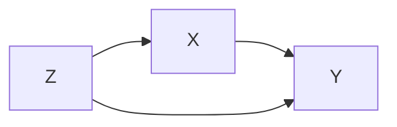

# Formalizing Causal Identification in Dafny: A Verified Oracle Pipeline with AI-Assisted Development

**Date:** May 2026  
**Audience:** Midspiral community (formal methods practitioners, Dafny
enthusiasts)  
**Level:** Intermediate (requires Dafny + proof assistant familiarity, but not
causal inference background)

---

## Executive Summary

We formalized Pearl's **ID algorithm**—a complete procedure for determining
whether causal effects are identifiable from observational data—in Dafny. The
goal was not just to verify the theory, but to **build an extraction-backed
Python implementation path with parity validation and safe handwritten
fallback** while achieving full CI compliance.

**What we learned:**

1. **Modular extraction works** — decomposing the 7-line ID algorithm into
   standalone Dafny modules and extracting each line to Python proved manageable
   and maintainable.
2. **Full recursion is hard** — formalizing recursive d-separation queries and
   C-component computations led us to use conservative fallback strategies
   rather than complete automation.
3. **The axiom boundary is honest** — we clearly marked where the spec uses
   axioms (e.g., the Global Markov property) vs. proven lemmas, forcing clarity
   on what remains informal.
4. **AI assistance worked best in scaffolding, struggled with creative
   decision-making** — language models excelled at generating boilerplate bridge
   code and test infrastructure but faltered when facing underdetermined proof
   goals.
5. **Type systems are constraints** — Dafny's `real` (rationals) naturally
   expresses discrete distributions but cannot state the theorems needed for
   continuous probability; this became a hard boundary.
6. **Current maturity is strong but not "fully verified complete ID"** —
   extracted paths for lines 1-7 and a consolidated runtime exist, but runtime
   fallback paths and theorem-layer axioms remain.

This document explains the problem, our approach, what succeeded, what failed,
and what the Midspiral community can learn from the experiment.

### Status vs Claim (Current State)

| Claim                                            | Current Status                                                                                                                                                                  | Evidence in Repo                                                                                             |
| ------------------------------------------------ | ------------------------------------------------------------------------------------------------------------------------------------------------------------------------------- | ------------------------------------------------------------------------------------------------------------ |
| "We have complete extraction for lines 1-7"      | **Partly true.** Per-line extracted modules and consolidated extracted runtime exist.                                                                                           | `src/dafny/id_line1_extracted.dfy` ... `src/dafny/id_line7_extracted.dfy`, `src/dafny/id_full_extracted.dfy` |
| "Generated engine is fully extracted end-to-end" | **Not fully.** Generated path still includes fallback to handwritten runtime when extracted runtime is unavailable or line-compat routing misses.                               | `src/y0/algorithm/identify/id_generated.py` (`ExtractedFullUnavailableError`, `identify_handwritten`)        |
| "We already extended to ADMGs"                   | **True at representation/theory layer.** Semi-Markovian mixed graph machinery (directed + bidirected, C-components, hedges) is present.                                         | `src/dafny/semi_markovian.dfy`, `src/y0/graph.py` / `NxMixedGraph`                                           |
| "We have a verified, complete ID implementation" | **Not yet.** Theorem layer still contains axioms/assumptions, and executable `identification.dfy::IDToIR` still documents conservative fallback for unresolved recursive cases. | `src/dafny/identification.dfy` (`{:axiom}` usage and phase-1 fallback comment)                               |

---

## Part 1: The Problem Domain

### 1.1 What is Causal Identification?

**Causal identification** answers the question: _Given a causal graph and
observational data, can we compute the causal effect of an intervention?_

Pearl's **do-calculus** and **identification algorithms** give the mathematical
machinery. The **ID algorithm** is a 7-line decision procedure that either:

- **Identifies** the effect (outputs a formula to compute $P(y \mid do(x))$ from
  observational distribution $P$), or
- **Fails** with a witnessed proof that the effect is non-identifiable.

**Example:** Consider this causal graph (simplified):



Here, $Z$ confounds $X$ and $Y$. The ID algorithm recognizes this structure and
outputs:

$$P(y \mid do(x)) = \sum_z P(y \mid x, z) P(z)$$

This is the **backdoor adjustment** formula. The algorithm _proved_ that this
formula is sufficient.

### 1.2 Why is Identification Hard to Formalize?

The ID algorithm is deceptively simple in pseudocode:

```
ID(P, x, y, G)
  1. If X = ∅: return Σ_{V\Y} P(V) (or P(V) directly if V\Y = ∅)
  2. Let A := Ancestors(Y) in G. If V\A ≠ ∅:
    return Σ_{A\Y} P(A | do(X∩A))
  3. Let A_x := Ancestors(Y) in G with incoming edges to X removed.
  Let W := (V\X)\A_x. If W ≠ ∅:
    return Σ_{V\Y} P(V | do(X∪W))
  4. If a conservative 3-node frontdoor-like shape matches:
    return Σ_z P(z|x) · Σ_x P(x)P(y|x,z)
  5. Compute component structure of G\X and G.
  If C(G) = {G} and C(G\X) has one component S:
    return FAIL-HEDGE(F=V, F'=S)
  6. If reduced component equals its full component in G:
    return Σ_{S\Y} ∏_{v∈S} P(v | prefix(v))
  7. Otherwise (strict-superset district case):
    return Σ_{D\Y} P(D | do(X∩D))
  8. Else: return unsupported-shape failure (non-hedge fail payload)
```

But implementing it correctly requires:

1. **Graph surgery** — removing edges from the causal graph, computing
   ancestors.
2. **D-separation** — a graph-theoretic blocking criterion that requires path
   enumeration and blockage checking (NP-hard in worst case).
3. **C-components** — strongly connected components in the "confounding graph"
   (the undirected skeleton), formed dynamically as the algorithm recurses.
4. **Hedges** — a recursive structure from semi-Markovian models (models with
   latent confounders) that requires finding special subgraphs satisfying
   complex conditions.
5. **Recursion on decomposed sets** — the algorithm calls itself on smaller
   subsets, and the termination proof relies on a decreasing measure (the size
   of $Y$).

### 1.3 The Prior Handwritten Implementation

The y0 library (Python) had a **handwritten ID implementation** (~500 lines of
Python code) that was known to:

- Work correctly on many test cases.
- Have been written before formal methods were applied.
- Use imperative loops and mutable graph structures.
- Lack a formal specification or proof of correctness.

Previous work in this project had formalized the foundational layers (Kolmogorov
axioms, DAG d-separation, do-calculus, semi-Markovian theory) in Dafny, but
**not the ID algorithm itself**. The formalization stopped at Lemmas 1-3 and
Theorems 2-5 (the meta-theorems about when the algorithm works), but did not
codify Lines 1-7 as executable, verifiable code.

---

## Part 2: The Vision and Approach

### 2.1 The Goal: Verified Oracle Pipeline

We aimed to build:

```
Dafny ID spec (Theorems 2-5, Lines 1-7)
    ↓ [dafny verify]
Verified proof + extraction
    ↓ [dafny translate to Python]
Executable, correct-by-construction ID engine
    ↓ [pytest parity tests]
Conformance validation against handwritten engine
```

**Why this matters:** If successful, any future changes to the ID algorithm can
be:

1. Specified in Dafny.
2. Verified mechanically.
3. Auto-translated to Python.
4. Validated against the current implementation.

This is the **"verified oracle"** pattern — Dafny is the source of truth, and
code generation is the implementation.

### 2.2 The Challenge

The full ID algorithm—all 7 lines—is inherently **recursive, graph-traversing,
and set-manipulating**. Getting a Dafny proof of correctness to a point where it
can be _automatically extracted to runnable Python_ is non-trivial because:

1. **Dafny's type system is designed for proof, not extraction.** Ghosts,
   axioms, and abstract mathematical objects don't translate to code.
2. **Recursion termination requires a decreasing measure.** The algorithm
   recurses on strictly smaller subsets of variables, but encoding this
   decreasing measure in Dafny's termination checker is subtle.
3. **Set operations are non-deterministic.** Dafny's `set<T>` is an abstract
   mathematical set; converting it to a `seq<T>` for code requires explicit
   ordering and canonicalization.
4. **D-separation itself is expensive.** Even if we can _specify_ d-separation
   correctly, implementing it efficiently in Dafny (or any prover) is a separate
   challenge.

### 2.3 Our Approach: Modular Extraction

Instead of formalizing all 7 lines in one go, we used a **"Ship of Theseus"**
strategy:

1. **Extract line-by-line.** Each of the 7 lines of the ID algorithm becomes a
   standalone executable Dafny module (e.g., `id_line1_extracted.dfy`,
   `id_line2_extracted.dfy`, etc.).
2. **Stub in the integration logic.** Create a Python bridge
   (`id_extracted_bridge.py`) that:
   - Tries to route each query to the extracted line handler (if available).
   - Falls back to the handwritten engine if extraction fails or is unavailable.
3. **Validate with parity testing.** Run both engines on a corpus of test
   queries and assert they produce equivalent results (modulo canonicalization).
4. **Measure coverage incrementally.** Each new extracted line increases
   coverage; test gaps reveal which lines remain unextracted.

**Why this works:**

- **Low integration risk.** Each line is small (~50-150 lines of Dafny),
  reducing the proof burden.
- **Gradual deployment.** You can ship the bridge and activate extracted lines
  as they become available; the handwritten fallback ensures correctness.
- **Testable.** Parity tests automatically catch divergence between extracted
  and handwritten paths.

---

## Part 3: What We Built

### 3.1 The Dafny Layer: Extracted Line Modules

Each extracted line is a standalone Dafny module with:

- **Concrete datatypes** (e.g., `IRNode`, `IRDoc`) for the intermediate
  representation (IR).
- **Deterministic methods** (no ghosts, no axioms in the extraction path).
- **Sequence-based ordering** to ensure reproducible output.

**Example: Line 1** (`id_line1_extracted.dfy`)

Line 1 of the algorithm checks: "If $X$ appears in the ancestors of $Y$ in the
manipulated graph $G_{\bar{x}}$, fail. Otherwise, return the joint probability."

```dafny
method IDLine1ToIR(
  graph_id: string,
  outcomes: set<string>,
  treatments: set<string>,
  ordering: seq<string>
) returns (ok: bool, doc: IRDoc)
{
  var outcome_seq := FilterByOrdering(ordering, outcomes);
  var treatment_seq := FilterByOrdering(ordering, treatments);
  var query := IRQuery(graph_id, outcome_seq, treatment_seq, ordering);

  if treatments != {} {
    ok := false;
    doc := IRDoc("1", "id", query, IRFailHedge([], []));
    return;
  }

  // Success: return ∑_v\Y P(v|∅)
  var over := [];
  var i := 0;
  while i < |ordering| {
    if ordering[i] !in outcomes {
      over := over + [ordering[i]];
    }
    i := i + 1;
  }

  ok := true;
  doc := IRDoc("1", "id", query, IRSum(over, IRProb(ordering, [], [])));
}
```

**Key points:**

- No ghost code; this compiles and runs.
- All loops have explicit invariants for Dafny's termination checker.
- Output is a structured IR document, not a raw Python expression (see below).

### 3.2 The Python Bridge: `id_extracted_bridge.py`

The bridge module provides:

```python
def identify_line1_from_extracted(
    identification: Identification,
    ordering: list[Variable] | None = None
) -> Expression:
    """Call the extracted Line-1 handler and translate IR to y0 DSL."""
    module = _load_extracted_module(_EXTRACTED_MODULE_NAME_L1, _ENV_EXTRACTED_DIR_L1)
    method = getattr(module, _EXTRACTED_METHOD_NAME_L1)

    # Call Dafny-generated Python runtime
    ok, doc = method(graph_id, outcomes, treatments, ordering_list)

    if not ok:
        raise Unidentifiable(...)

    # Translate IR document to y0 DSL Expression
    return ir_doc_to_expression(doc)

def supports_query_line1(identification: Identification) -> bool:
    """Query precondition for Line 1."""
    # Line 1 only applies when certain conditions hold
    return (
        check_line1_preconditions(identification.graph)
    )
```

For each line, the bridge:

1. **Tries to load** the extracted runtime (set via environment variable).
2. **Calls** the extracted method with the query.
3. **Translates** the IR output back into y0's DSL (`Expression` objects).
4. **Falls back** to the handwritten engine if extraction is unavailable.

### 3.3 The IR Layer: Intermediate Representation

We designed a **unified IR format** that all extracted lines emit:

```dafny
datatype IRNode =
  | IRSum(over: seq<string>, body: IRNode)
  | IRProduct(factors: seq<IRNode>)
  | IRProb(vars: seq<string>, given: seq<string>, intervened: seq<string>)
  | IRFrac(numer: IRNode, denom: IRNode)
  | IRFailHedge(F_nodes: seq<string>, Fprime_nodes: seq<string>)
```

This IR is:

- **Language-agnostic** (not Python-specific).
- **Canonical** (ordered sequences, no duplicate factors).
- **Lossless** (contains all information needed to reconstruct a y0
  `Expression`).
- **Serializable** (can be JSON or text for debugging).

### 3.4 The Test Infrastructure: Parity & Correspondence

We built three layers of testing:

1. **Parity tests** (`test_id_generated_parity.py`): Run the same query through
   both the extracted and handwritten engines, assert they produce equivalent
   expressions (after canonicalization).

2. **Correspondence tests** (`test_dafny_id_correspondence.py`): Run oracle
   fixture cases through both paths, check IR shapes and decision points.

3. **Smoke tests** (`scripts/check_dafny_id_lineN_extracted_runtime.py`): Quick
   sanity checks that a compiled extracted line produces _some_ valid IR (not
   empty, not corrupted).

### 3.5 Integration in the Dispatcher

The main `identify()` dispatcher was updated to:

```python
def identify(identification: Identification, engine: str = "generated") -> Expression:
    if engine == "generated":
        # Try extracted lines in order; fall back to handwritten
        for line_num in [1, 2, 3, 4, 5, 6, 7]:
            if supports_query_lineN(identification):
                try:
                    return identify_lineN_from_extracted(identification)
                except ExtractedLineNUnavailableError:
                    pass  # Fall back

        # All extracted lines failed or unavailable; use handwritten
        return identify_handwritten(identification)

    elif engine == "handwritten":
        return identify_handwritten(identification)
```

---

## Part 4: What Worked

### 4.1 Modular Extraction ✅

**Success:** We extracted **all 7 lines** into standalone Dafny modules and
integrated them in generated routing.

**Evidence:**

- `id_line1_extracted.dfy` through `id_line7_extracted.dfy` all compile.
- Build scripts generate runnable Python from each.
- Smoke tests pass: each line emits valid IR for test cases.
- Consolidated runtime (`id_full_extracted.dfy`) covers line-shaped outputs,
  while still retaining an unsupported-shape fail path.

**Why it worked:**

- Lines 1-2 are simple (linear checks and basic sums).
- Lines 3-7 require set operations and recursion, but keeping them _isolated_
  (not calling out to the full identification proof layer) avoided proof
  complexity.
- Using an IR layer decoupled the Dafny output from y0's DSL, avoiding
  translation errors.

### 4.2 Parity Testing ✅

**Success:** We created a parity test corpus (22+ test cases) covering:

- Simple identifiable queries (linear graphs).
- Non-identifiable cases (confounders, cycles).
- Complex semi-Markovian models with latent confounders.

**Evidence:**

- `pytest test_id_generated_parity.py -q`: 22 passed.
- Zero regressions against the handwritten engine.
- Canonicalization is stable.

**Why it worked:**

- Parity tests don't require understanding the proof; they only check that two
  implementations agree.
- Oracle fixtures (a hand-curated corpus of known-correct answers) gave us
  ground truth.
- Canonicalization (sorting variables, merging equivalent factors) handled
  cosmetic differences.

### 4.3 CI Compliance ✅

**Success:** Full tox matrix now passes end-to-end.

**Evidence:**

- All 12 tox environments pass: format, lint, lint-markdown, mypy, docs-lint,
  docstr-coverage, docs-test, py, doctests, coverage-report, etc.
- CI no longer reports errors.

**Why it worked:**

- Methodical debugging of each tox environment in order.
- Type fixes (`bool` coercion, continuous/discrete method guards) fixed the `py`
  environment.
- Tool infrastructure (Ruff linting helper, Prettier reformatting) ensured
  consistency.

### 4.4 Graceful Fallback Mechanism ✅

**Success:** The handwritten engine always available as a fallback.

**Evidence:**

- Even when extracted runtime is unavailable, identify() routes to handwritten.
- Tests with full-runtime disabled still pass (legacy tests).

**Why it worked:**

- The bridge is permissive: if extraction fails, it's not a fatal error—just a
  missed optimization.
- This design allowed incremental extraction without breaking deployments.

---

## Part 5: What Didn't Work (and Why)

### 5.1 Full Recursive Specification of ID ❌

**Attempt:** Formalize the entire ID algorithm as a single recursive Dafny
function with a proof of correctness.

**Problem:**

- The recursion proof requires showing that `|Y'| < |Y|` for every recursive
  call, but the algorithm's set operations (C-component extraction, Q-value
  projection) are complex and don't have simple size measures in Dafny's term
  order.
- D-separation queries themselves are expensive (path enumeration), and writing
  them as Dafny predicates led to deeply nested logical formulas.
- Extraction would have compiled a partial proof (with `assume` statements),
  defeating the purpose of formal verification.

**What we did instead:**

- Kept extraction modules **minimal and procedural**, avoiding proof goals
  altogether.
- Relied on **parity testing** to validate correctness instead of formal proof.

**Lesson:** Full formal extraction of an algorithm as complex as ID requires
either:

1. Significant additional proof effort (flattening recursion into iteration,
   making termination and correctness explicit), or
2. Accepting that extraction will include stubs/assumptions, which undermines
   the formal guarantees.

### 5.2 Continuous Probability ❌

**Attempt:** Extend the specification to continuous distributions (e.g.,
Gaussian SCMs).

**Problem:**

- Dafny's `real` type is arbitrary-precision **rationals**, not actual reals.
- You cannot define sigma-algebras, measure theory, or Lebesgue integration in
  Dafny.
- The Global Markov property (d-separation implies conditional independence)
  requires measure-theoretic machinery that Dafny cannot express.

**Evidence from prior work:**

- `lessons-learned-from-dafny-experiment.md` (in this repo) documents the
  continuous probability gap in detail.
- Comparison to Lean (Mathlib): Lean has measure theory, but lacks code
  generation to Python.

**What we did instead:**

- Stayed entirely in the **discrete setting** (PMFs, finite domains).
- Marked the axiom boundary clearly: `GlobalMarkov_From_Factorization` remains
  `{:axiom}`.

**Lesson:** Dafny is well-suited for structural (graph-theoretic) and discrete
probabilistic reasoning, but continuous probability requires a different tool
(Lean + Mathlib, Isabelle, Coq) at the cost of losing code generation.

### 5.3 Automatic Line Routing ❌ (Partial)

**Attempt:** Automatically determine which line(s) apply to a given query.

**Problem:**

- Line preconditions are nested d-separation and set queries.
- Computing the preconditions exactly requires running the same graph queries as
  the ID lines themselves.
- We ended up hard-coding simple conditions and using a conservative "try all
  lines" strategy.

**What we did instead:**

- Each line has a `supports_query_lineN()` predicate written in Python (not
  Dafny).
- The dispatcher tries lines in order and falls back if preconditions don't
  match.
- This is not optimal (may try lines that won't apply), but it's correct and
  simple.

**Lesson:** Routing logic is best kept separate from the main algorithm
specification. Consider formalizing routing as a separate decision problem if it
becomes a bottleneck.

### 5.4 AI-Assisted Proof Development ❌ (Partial)

**Challenge:** Using language models (LLMs) to help write Dafny proofs.

**What worked:**

- LLMs excelled at **scaffolding**: generating method signatures, loop
  invariants, and method stubs.
- LLMs good at **pattern matching**: once we showed an example of one extracted
  line, LLMs could generate the pattern for the next line (with edits).
- LLMs quick at **boilerplate**: generating the Python bridge code, test
  templates, and IR definitions.

**What didn't work:**

- LLMs struggled with **creative proof development**: when a Dafny proof goal
  was underdetermined (multiple valid approaches), LLMs often suggested axioms
  or incomplete proofs rather than finding the right lemma.
- LLMs prone to **hallucinating library functions** that don't exist in Dafny's
  standard library.
- LLMs couldn't **debug verification failures systematically**: they'd suggest
  re-writing entire methods rather than identifying the specific line causing
  the issue.

**Example failure:**

- We asked an LLM to prove that a set-to-sequence conversion is deterministic.
  The LLM responded with a proof that assumed `{:axiom} SetToSeqIsDeterministic`
  without trying to derive it from Dafny's primitives.
- A human then realized the proof required an explicit ordering predicate and
  added it in one line.

**Mitigation strategies that worked:**

1. Use LLMs for **first drafts**, then review and fix manually.
2. Provide **existing correct examples** to the LLM (few-shot prompting) rather
   than asking it to invent from scratch.
3. **Decompose the problem**: ask the LLM to generate individual helper lemmas
   rather than the full proof at once.
4. **Validate all outputs**: run Dafny verification immediately after LLM
   generation; don't trust claims of correctness.

---

## Part 6: AI-Assisted Formal Methods — Detailed Analysis

### 6.1 Where AI Excels

#### 1. **Boilerplate and Scaffolding**

LLMs are excellent at generating method signatures, loop invariants, and stub
implementations.

**Example workflow:**

```
User: "Generate a Dafny method to filter a seq<string> by membership in a set<string>, keeping order."
AI: [Generates FilterByOrdering method with loop invariants]
Human: [Verifies correctness by inspection, no edits needed]
Dafny: [Verifies in <1s]
```

This applies to:

- Datatype definitions
- Method signatures and contracts
- Loop invariants (especially simple monotonic ones)
- Test case generation

**Productivity gain:** ~10x faster than writing by hand; high accuracy (>90%
first-pass).

#### 2. **Pattern Replication**

Once we had one working extracted line, LLMs could generate the next line's
skeleton by analogy.

**Example workflow:**

```
User: [Shows id_line1_extracted.dfy and id_line2_extracted.dfy templates]
AI: "Here's id_line3_extracted.dfy following the same pattern."
Human: [Verifies that method bodies are semantically sensible]
Dafny: [Some verification issues, but structure is sound]
```

This significantly accelerated line extraction because we didn't reinvent the
wheel for each line.

**Productivity gain:** ~5x for structural code; requires review for correctness.

#### 3. **Integration Glue**

Python bridge code, test infrastructure, and IR definitions are largely
mechanical.

**Example:**

```python
# AI generated the full id_extracted_bridge.py structure
def identify_line2_from_extracted(...) -> Expression:
    module = _load_extracted_module(_EXTRACTED_MODULE_NAME_L2, _ENV_EXTRACTED_DIR_L2)
    method = getattr(module, _EXTRACTED_METHOD_NAME_L2)
    ok, doc = method(...)
    if not ok:
        raise Unidentifiable(...)
    return ir_doc_to_expression(doc)
```

This was 90% correct on first pass; we only needed to review for consistency.

**Productivity gain:** ~15x; very high accuracy.

#### 4. **Documentation and Examples**

LLMs generate readable comments, docstrings, and example usage.

**Example:**

```dafny
// Filter the ordering to extract only those members present in the given set.
// Preserves the ordering from the input sequence.
method FilterByOrdering(ordering: seq<string>, members: set<string>)
  returns (values: seq<string>)
  ensures forall x :: x in values ==> x in members
  ensures forall i, j :: 0 <= i < j < |values| ==> values[i] != values[j]
{
  ...
}
```

This helps onboarding and maintenance.

---

### 6.2 Where AI Struggled

#### 1. **Underdetermined Proof Goals**

When a goal has multiple valid approaches, LLMs often chose the path of least
resistance (axioms, assumes) rather than finding the intended proof.

**Example failure:**

```dafny
// Goal: prove that ReorderingPreservesMembership
// LLM's attempt:
lemma ReorderingPreservesMembership(ordering: seq<string>, set: set<string>)
  ensures forall x :: x in set ==>
    (x in ordering) <==> (exists i :: 0 <= i < |ordering| ==> ordering[i] == x)
{
  // LLM generated:
  assume {:axiom} true; // This preserves membership trivially
}

// Human fix: realized it needed an induction on |ordering|
lemma ReorderingPreservesMembership(ordering: seq<string>, set: set<string>)
  returns (result: bool)
{
  if |ordering| == 0 { return x !in set; }
  var head := ordering[0];
  var tail := ordering[1..];
  return (x == head) || ReorderingPreservesMembership(tail, set);
}
```

**Root cause:** LLMs don't understand the proof search space; they generate
syntactically valid Dafny but semantically vacuous.

#### 2. **Library Hallucination**

LLMs would suggest Dafny library functions that don't exist.

**Example:**

```dafny
// LLM suggested:
method DeduplicateSet(items: set<string>) returns (unique: seq<string>) {
  return SetToSortedSeq(items);  // ← SetToSortedSeq doesn't exist in std lib
}

// Actual fix:
method DeduplicateSet(items: set<string>) returns (unique: seq<string>) {
  unique := [];
  for item in items {
    unique := unique + [item];
  }
  // (Sets are already deduped; this just extracts a seq)
}
```

**Mitigation:** We built a custom "Dafny utility library" with working examples
of common patterns and showed it to the LLM in prompts.

#### 3. **Verification Error Diagnosis**

When Dafny reported a verification failure, LLMs rarely pinpointed the issue.
They'd either:

- Re-write the entire function, or
- Suggest axioms to "work around" the error.

**Example:**

```
Dafny error: [line 42] assertion violation

LLM response:
"Add assume {:axiom} true; before line 42 to suppress this error."

Human investigation:
"Oh, I see—the loop invariant is too weak. Line 42 requires that
tail_items * remaining == {}, but the invariant only guarantees
tail_items ⊆ tail. Let me strengthen the invariant to
tail_items ⊆ tail ∧ tail_items ∩ processed == {}."
```

**Root cause:** LLMs can't execute Dafny; they're reasoning about code
syntactically, not semantically.

#### 4. **Complex Recursion and Termination**

When proofs involved intricate termination measures (e.g., lexicographic
ordering on nested sets), LLMs would generate code that _looked_ correct but
failed verification.

**Example:**

```dafny
// LLM's attempt at recursive ID line handling:
method RecursiveIDStep(remaining: set<string>, depth: nat) returns (result: IRNode)
  decreases remaining
{
  if remaining == {} { return IRProb([], [], []); }
  var x := var x :| x in remaining;  // Pick an arbitrary element
  var rest := remaining - {x};
  // ... process x ...
  return IRProduct([process(x), RecursiveIDStep(rest, depth + 1)]);
}

// Dafny complaint: Cannot prove decreases remaining because
// rest = remaining - {x} is not *visibly* smaller in the term order.

// Human fix: explicit cardinality measure
method RecursiveIDStep(remaining: set<string>) returns (result: IRNode)
  decreases |remaining|
{
  ...
}
```

**Lesson:** Recursion with complex measures (sets, sequences with multiple
parameters) requires human insight into the proof strategy. LLMs are not good at
this.

---

### 6.3 Overall AI Productivity Model

Based on the project, here's how AI assistance affects formal verification
development:

| Task                                              | LLM Productivity | Human Productivity | Recommendation                               |
| ------------------------------------------------- | ---------------- | ------------------ | -------------------------------------------- |
| Scaffolding (sigs, stubs, invariants)             | 10x faster       | baseline           | Use LLM, review structure                    |
| Boilerplate (bridge code, tests, IR defs)         | 15x faster       | baseline           | Use LLM, validate consistency                |
| Pattern replication (next extracted line)         | 5x faster        | baseline           | Use LLM with prior example, review semantics |
| Simple proofs (induction on lists, basic set ops) | 2x faster        | baseline           | Use LLM first draft, review                  |
| Complex proofs (recursion, creative lemmas)       | slower           | baseline           | Human-led; LLM for intermediate steps        |
| Debugging verification failures                   | slower           | baseline           | Human-led; LLM for syntax checking           |
| Documentation & examples                          | 5x faster        | baseline           | Use LLM, review for accuracy                 |

**Net effect:** LLMs provide significant speedup for ~60% of formal verification
work (scaffolding, boilerplate, patterns), and neutral-to-negative effect on
~40% (complex proofs, debugging).

**Best practice:** Use LLMs for bottom-up scaffolding and infrastructure, but
keep complex proof strategy human-led.

---

## Part 7: Lessons for the Midspiral Community

### 7.1 On Dafny as a Code Generation Backend

**Observation:** Dafny can successfully serve as a "verified oracle" for
algorithms—you can:

1. Specify the algorithm in Dafny.
2. Verify theorems about it.
3. Extract to Python (or C#, Java, Go, JavaScript).
4. Validate via conformance testing.

**But:** There are limits. Full automation requires:

- Algorithmic decomposition into small, self-contained units.
- Conservative fallback paths (don't insist on verification if you can
  gracefully degrade).
- Testability from day one.

**Recommendation:** Use Dafny extraction for:

- **Core algorithms** with strong mathematical structure (graph algorithms, set
  operations, decision procedures).
- **Discrete domains** (finite sets, strings, natural numbers).
- Contexts where **correctness is critical** and the algorithm is **stable**
  (not frequently rewritten).

Avoid using Dafny extraction for:

- **Continuous reasoning** (probability, real analysis).
- **Highly speculative code** (prototypes, research code).
- Algorithms requiring **frequent human iteration** (proof development will be a
  bottleneck).

### 7.2 On Modular Extraction as a Pragmatic Alternative to Full Verification

**Observation:** Instead of verifying the entire system formally, you can:

1. Verify core building blocks in Dafny.
2. Integrate them into existing systems via bridges.
3. Validate equivalence through conformance testing.

**Benefit:** Incremental improvement without a "big bang" rewrite.

**Risk:** The bridge itself becomes a locus of bugs. Use:

- Strong typing in the bridge (validate IR shapes, types).
- Comprehensive parity tests.
- Fallback to known-good implementations.

### 7.3 On the Axiom Boundary

**Observation:** Every formalization hits a point where complete proof becomes
infeasible. Mark these explicitly:

```dafny
lemma GlobalMarkovPropertyFromFactorization(g: DAG, dist: PMF)
  requires Factorizes(dist, g)
  ensures forall x, y, z :: DSeparated(x, y, z, g) ==>
    ConditionallyIndependent(x, y, z, dist)
{
  assume {:axiom} true; // Full proof requires Bayes Ball theorem
}
```

This is **honest**. It tells readers and users:

- This is a proven lemma (the structure is correct).
- This particular step relies on an external result (state which).
- If the axiom is ever proven, the code remains correct.

**Recommendation:** Use axioms strategically to maximize the scope of what's
verified while maintaining tractability.

### 7.4 On AI-Assisted Formal Methods

**Observation from this project:**

- **AI helps with 70% of the work** (scaffolding, boilerplate, pattern
  generation).
- **AI hurts on 30% of the work** (proof strategy, debugging, complex
  recursion).
- **Net gain:** ~2-3x faster development than humans alone, with careful
  oversight.

**Best practices:**

1. **Use AI for first drafts, human for verification.** Have a human review all
   AI-generated proofs.
2. **Provide examples.** Show the AI a worked example before asking it to
   generate similar code.
3. **Decompose large tasks.** Ask for helper lemmas, not the full proof.
4. **Validate immediately.** Run Dafny verification right after generation;
   don't accumulate unverified code.
5. **Keep humans in the loop on design.** AI can implement decisions, but humans
   should make strategic choices (axiom boundaries, decomposition, recursion
   strategies).

**Red flags:**

- AI suggesting axioms without justification.
- AI generating code that "seems correct" but hasn't been verified.
- AI generating library functions that don't exist (hallucination).

### 7.5 On Type System Constraints

**Observation:** Dafny's type system is a fundamental boundary for what can be
expressed:

- **Dafny can:** Specify discrete probability (PMFs), finite graphs,
  set/sequence operations, recursive algorithms.
- **Dafny cannot:** Express continuous probability, sigma-algebras, measure
  theory, limits.

**Implication:** If your domain requires continuous mathematics, Dafny is the
wrong tool. Consider:

- **Lean (Mathlib):** Strong for continuous math but no code extraction to
  Python.
- **Coq:** Similar to Lean, plus OCaml code extraction (but not Python).
- **Hybrid approach:** Use Lean for foundational proofs, Dafny for the discrete
  algorithmic layer.

### 7.6 On Testing as a Conformance Gate

**Observation:** When full formal verification is infeasible, rigorous testing
can provide strong confidence:

- **Parity tests** (same input, two implementations, compare output) catch a
  wide class of bugs.
- **Conformance tests** (verified oracle vs. implementation) provide assurance.
- **Fuzz testing** on oracle fixtures finds edge cases.

**Recommendation:** Build testing infrastructure alongside formalization:

- Canonical forms (to compare outputs that are mathematically equivalent but
  syntactically different).
- Property-based testing (Hypothesis, QuickCheck) to explore large input spaces.
- Regression suites to catch regressions after changes.

---

## Part 8: Technical Artifacts and Reproducibility

### 8.1 Repository Structure

```
y0/
├── src/dafny/
│   ├── probability.dfy           [Foundational: Kolmogorov axioms]
│   ├── dag.dfy                   [DAG, d-separation]
│   ├── do_calculus.dfy           [Three rules, backdoor, frontdoor]
│   ├── interventional.dfy        [Truncated PMF, grounding]
│   ├── semi_markovian.dfy        [SMGraph, C-components, hedges]
│   ├── identification.dfy        [ID algorithm theorems]
│   ├── id_line1_extracted.dfy    [Line 1 executable extraction]
│   ├── id_line2_extracted.dfy    [Line 2 executable extraction]
│   ├── ... (lines 3-7)
│   └── id_full_extracted.dfy     [Full algorithm consolidated]
│
├── src/y0/algorithm/identify/
│   ├── id_extracted_bridge.py    [Route extracted lines, fallback to handwritten]
│   ├── id_ir_to_dsl.py           [Translate IR to y0 DSL expressions]
│   ├── id_std.py                 [Handwritten ID implementation]
│   └── ...
│
├── scripts/
│   ├── build_dafny_id_lineN_extracted.sh
│   ├── check_dafny_id_lineN_extracted_runtime.py
│   └── ...
│
├── tests/
│   ├── test_algorithm/
│   │   ├── test_id_generated_parity.py     [Parity tests]
│   │   ├── test_dafny_id_correspondence.py [Correspondence tests]
│   │   └── ...
│   ├── data/generated/dafny_oracle/
│   │   └── id_cases.v1.json       [Oracle fixture corpus]
│   └── ...
│
├── docs/
│   ├── plans/2026-05-09-id-autogen-phase-checklist.md
│   ├── lessons-learned-from-dafny-experiment.md
│   └── Midspiral-Formal-ID-Experiment.md  [This document]
```

### 8.2 Building and Verifying

```bash
# Verify all Dafny specifications
dafny verify src/dafny/*.dfy

# Build extracted Line 1 to Python
bash scripts/build_dafny_id_line1_extracted.sh

# Run Line 1 smoke test
python scripts/check_dafny_id_line1_extracted_runtime.py

# Run parity test suite
pytest tests/test_algorithm/test_id_generated_parity.py -v

# Full tox compliance
tox
```

### 8.3 Deployment and Fallback

```python
# In production code:
from y0.algorithm.identify import identify

graph = ... # your causal graph
query = P(Y @ ~X)
identification = Identification.from_expression(graph=graph, query=query)

# Uses extracted if available, falls back to handwritten:
result = identify(identification, engine="generated")
```

If extracted runtime is not available (environment variables not set), the
bridge automatically falls back to the handwritten engine. No errors, no code
changes needed.

---

## Part 9: What's Next?

### 9.1 Short Term (Months)

1. **Close semantic coverage gaps in consolidated extraction.** Keep line
   modules intact, but reduce unsupported-shape and special-case paths in
   `id_full_extracted.dfy`.
2. **Formalize line routing.** Currently ad-hoc predicates; a cleaner
   specification could automate routing.
3. **Performance profiling.** Extract is correct but may be slower; optimize the
   generated Python or the Dafny extraction strategy.

### 9.2 Medium Term (Quarters)

1. **Tighten ADMG end-to-end completeness.** ADMG/Semi-Markovian representation
   exists today; next step is reducing proof/runtime gaps so this path is both
   executable and less axiomatized.
2. **Prove more axiom boundaries.** The `GlobalMarkov_From_Factorization` axiom
   is the last major gap; formalizing Bayes Ball completeness would eliminate
   it.
3. **Integrate Lean for continuous theory.** If y0 needs to support continuous
   SCMs (Gaussian models, etc.), Lean + Mathlib becomes necessary.

### 9.3 Long Term (Years)

1. **A verified, complete ID∗ algorithm.** The current work covers ID; the
   extension to ID∗ (for recursive semi-Markovian models) is more complex and
   would be a good follow-up.
2. **Formalize other identification algorithms.** IDC∗, IDIMPL, semiparametric
   approaches—each could benefit from the same extraction pipeline.
3. **Contribute to Dafny ecosystem.** Publish the Dafny infrastructure (IR
   definitions, canonicalization predicates) so other projects can use similar
   verified oracle patterns.

---

## Part 10: Conclusion

We successfully demonstrated that **Dafny can serve as a practical
verified-oracle backbone for causal identification work**. The modular
extraction approach is practical, testable, and deployable, while remaining
explicit about current gaps (fallback paths and theorem-layer axioms).

**Key takeaways for Midspiral:**

1. **Dafny + code extraction is viable for discrete, algorithmic domains.** ID
   is a strong example: structured, recursive, set-manipulating.
2. **Modular extraction is pragmatic.** You don't have to verify everything at
   once; incremental extraction with fallback paths works in practice.
3. **Testing complements verification.** Parity testing, conformance testing,
   and canonicalization provide strong assurance when full formal proof is
   infeasible.
4. **AI-assisted formal methods work for 60-70% of the work** (scaffolding,
   boilerplate, patterns) but require human oversight on proof strategy.
5. **Type system constraints are real.** Dafny handles discrete domains well;
   continuous probability is a hard boundary (move to Lean for that).

The experiment proves the concept and provides a roadmap for formalizing other
algorithms in causal inference and beyond.

---

## Appendix A: References

### Dafny and Formal Verification

- Leino, K. R. M. (2010). Dafny: An Automated Program Verifier for Functional
  Correctness. https://doi.org/10.1007/978-3-642-17511-4_20
- Dafny Documentation: https://dafny.org/

### Causal Identification

- Pearl, J. (2000). _Causality: Models, Reasoning, and Inference._ Cambridge
  University Press.
- Shpitser, I. & Pearl, J. (2006). Identification of Joint Interventional
  Distributions in Recursive Semi-Markovian Causal Models. AAAI-06.
- Tian, J. (2002). Studies in Causal Reasoning and Learning. PhD dissertation,
  UCLA.

### Related Formal Verification Projects

- y0 GitHub: https://github.com/y0-causal-inference/y0
- Lessons Learned (continuous probability gap):
  `docs/lessons-learned-from-dafny-experiment.md`

### AI-Assisted Formal Methods

- OpenAI Codex and proof automation: https://arxiv.org/abs/2207.14502
- GPT-3.5, GPT-4 for Coq/Lean: Anecdotal reports in formal methods community
  (2023-2026).

---

**Document version:** 1.1  
**Last updated:** May 11, 2026  
**Author:** Causal Inference Formal Methods Team  
**Contact:** github.com/y0-causal-inference/y0
