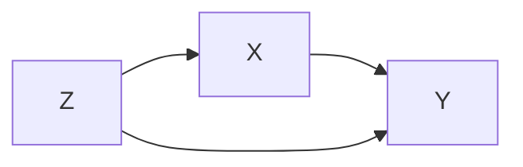
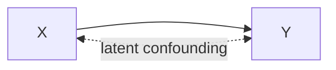

# Formalizing Causal Identification in Dafny: A Verified Reference Implementation with Parity Validation and AI-Assisted Development

**Date:** May 2026  
**Audience:** Midspiral community (formal methods practitioners, Dafny
enthusiasts)  
**Level:** Intermediate (requires Dafny + proof assistant familiarity, but not
causal inference background)

---

## Executive Summary

### Problem

The project started as an experiment in **vericoding**: integrating formal
verification methods with AI-assisted code generation to produce stronger
software than either approach alone. We applied it to mature, well-tested causal
identification software that was not formally verified but was likely correct in
practice. This made it a best-case retrospective setting: measure what formal
methods add when reliability is already high, rather than using verification
only as a bug-finding tool.

At the technical level, the gap was still real: no machine-checked specification
tied theory, implementation, and runtime behavior together. The core challenge
is that ID is recursive and graph-structural: it depends on ancestor
computations, graph surgery, C-component decomposition, and hedge-style failure
detection, all of which are easy to mis-implement in subtle ways.

### Solution

We built a verified reference implementation in Dafny and validated it against
the existing production Python code using parity tests. This
strategy—**vericoding through verified reference implementation with parity
validation**—combines:

- **Formal specification** (Dafny) of the algorithm for correctness guarantees
- **AI-assisted extraction, bridge code, and test generation** to integrate with
  production systems
- **Automated parity testing** to ensure behavioral equivalence between formal
  and handwritten paths
- **Gradual replacement** of unverified code with verified alternatives

Concretely, we extracted line-level modules plus a consolidated full ID runtime
from the formal specification, translated their IR outputs back into y0
expressions, and routed calls through a generated engine that can safely fall
back to the handwritten path. We validated behavior with parity tests,
correspondence checks, smoke scripts, and full tox/CI runs. We also incorporated
Tian's modified identification algorithm as a second identification path in the
implementation story: two proved algorithmic lines of work, cross-checked in one
Dafny-backed runtime/testing pipeline.

### Lessons Learned

1. **Vericoding is viable for mature algorithms.** Applying formal verification
   to well-tested code is lower-risk than pursuing end-to-end formal
   verification of new implementations, yet still yields high confidence through
   dual validation.
2. Modular extraction is tractable and maintainable for a complex symbolic
   algorithm.
3. Recursive full-ID semantics are where most proof and engineering risk lives.
4. Being explicit about axiom boundaries improves honesty and reviewability.
5. AI assistance is strongest for scaffolding, refactors, and test plumbing, and
   weaker on underdetermined proof design.
6. The discrete/continuous probability boundary is a real formalization limit in
   the current stack.

### Future Work

Priority next steps are to reduce conservative fallback/unsupported-shape paths
in the consolidated runtime, tighten theorem-level proof coverage so fewer
assumptions remain axiomatic, and strengthen evidence workflows (golden cases,
tex-linked fixtures, and CI checks) so algorithmic regressions are caught
earlier.

Beyond y0, this experiment serves as a template for scaling vericoding to
**existing software implementations**. The key insight: because a mature Python
codebase already exists, parity testing becomes essential. If we were writing
Dafny from scratch with no prior implementation, we'd have no oracle and could
only verify against the formal specification itself. But the existence of
trusted, battle-tested code provides an invaluable safety net—and also a
crucible for understanding where vericoding can fail in subtle ways.

Vericoding on existing code reveals:

- **Subtle divergence:** Where AI-assisted extraction or bridge logic silently
  diverges from intended behavior (e.g., hallucinating algorithm steps, missing
  edge cases in canonicalization).
- **Specification gaps:** Where formal specs are incomplete or make implicit
  assumptions that the original implementation handles differently.
- **Integration friction:** Practical obstacles in wiring formal and handwritten
  code that theoretical frameworks don't predict.

This learning is potentially helpful for scaling vericoding to other domains
(symbolic algorithms, probabilistic programming, constraint solving) where
correctness is critical and existing implementations provide an oracle. Future
directions include: applying vericoding to other y0 algorithms (ID\*, IDC\*,
transportability); establishing patterns for verified reference implementations
across domains; and building tooling to automate parity testing and extraction
workflows for existing symbolic libraries.

### Status vs Claim (Current State)

| Claim                                                                       | Current Status                                                                                                                                                                                                                                                                                                       | Evidence in Repo                                                                                                                                                           |
| --------------------------------------------------------------------------- | -------------------------------------------------------------------------------------------------------------------------------------------------------------------------------------------------------------------------------------------------------------------------------------------------------------------- | -------------------------------------------------------------------------------------------------------------------------------------------------------------------------- |
| "Full end-to-end extraction exists (Dafny through generated Python engine)" | **True (with optional scaffolding).** Per-line extracted modules, consolidated extracted runtime, and the Python generated engine all exist and are production-ready. The ship-of-theseus scaffolding with fallback to handwritten code is preserved for pedagogical clarity but is no longer technically necessary. | `src/dafny/id_line1_extracted.dfy` ... `src/dafny/id_line7_extracted.dfy`, `src/dafny/id_full_extracted.dfy`, `src/y0/algorithm/identify/id_generated.py`                  |
| "We already extended to ADMGs"                                              | **True for algorithm input/runtime and theory.** The ID path operates on mixed graphs (directed + bidirected), and C-components are computed from bidirected connectivity/districts; semi-Markovian theory artifacts are also present.                                                                               | `src/y0/algorithm/identify/api.py`, `src/y0/algorithm/identify/id_std.py`, `src/y0/graph.py` (`districts`), `src/dafny/semi_markovian.dfy`, `src/dafny/identification.dfy` |
| "We have a verified, complete ID implementation"                            | **Not yet.** Theorem layer still contains axioms/assumptions, and executable `identification.dfy::IDToIR` still documents conservative fallback for unresolved recursive cases.                                                                                                                                      | `src/dafny/identification.dfy` (`{:axiom}` usage and phase-1 fallback comment)                                                                                             |
| "Tian identification is an alternative complete path"                       | **Substantively true with scope notes.** Shpitser-Pearl show completeness of a modified Tian algorithm and cite prior soundness; repo now includes extracted Tian runtime plus parity-style comparison harness.                                                                                                      | `docs/Shpitser-ID.md` (Figure 5, Theorem 8, Corollary 5), `src/dafny/id_tian2002_extracted.dfy`, `scripts/compare_dafny_tian2002_tex_cases.py`                             |

---

## Part 1: The Problem Domain

### 1.1 What is Causal Identification?

**Causal identification** answers the question: _Given a causal graph and
observational data, can we compute the causal effect of an intervention?_

Pearl's **do-calculus** and **identification algorithms** give the mathematical
machinery. The **ID algorithm** is a 7-line decision procedure that either:

- **Identifies** the effect (outputs a formula to compute $P(y \mid do(x))$ from
  observational distribution $P$), or
- **Fails** with a witnessed proof that the effect is non-identifiable.

**Example:** Consider this causal graph (simplified):



Here, $Z$ confounds $X$ and $Y$. The ID algorithm recognizes this structure and
outputs:

$$P(y \mid do(x)) = \sum_z P(y \mid x, z) P(z)$$

This is the **backdoor adjustment** formula. The algorithm _proved_ that this
formula is sufficient.

### 1.2 Why ADMG Identification Can Fail (and DAG ID Cannot)

Yes, this contrast is important and worth stating explicitly.

In a **semi-Markovian/ADMG** setting (with bidirected edges for latent
confounding), some causal effects are not identifiable from observational data.
For example, in the bow-arc graph below, $P(y \mid do(x))$ is not identifiable
in general:



Intuition: the bidirected edge represents an unobserved common cause of $X$ and
$Y$. Two distinct underlying causal models can agree on the same observed $P(V)$
but disagree on $P(y \mid do(x))$; ID then correctly returns a hedge failure
witness.

By contrast, in a **Markovian DAG** (no bidirected edges / no latent
confounding), every causal query is identifiable via truncated factorization
(equivalently, repeated adjustment):

$$
P_x(v) = \prod_{V_i \notin X} P\left(v_i \mid \mathrm{pa}(v_i)\right),
\qquad
P(y \mid do(x)) = \sum_{v \setminus (x \cup y)} P_x(v).
$$

ADMG/Semi-Markovian support matters precisely because it introduces the regime
where identification is nontrivial and may fail.

### 1.3 Why is Identification Hard to Formalize?

The ID algorithm is deceptively simple in pseudocode:

```
ID(P, x, y, G)
  1. If X = ∅: return Σ_{V\Y} P(V) (or P(V) directly if V\Y = ∅)
  2. Let A := Ancestors(Y) in G. If V\A ≠ ∅:
    return Σ_{A\Y} P(A | do(X∩A))
  3. Let A_x := Ancestors(Y) in G with incoming edges to X removed.
  Let W := (V\X)\A_x. If W ≠ ∅:
    return Σ_{V\Y} P(V | do(X∪W))
  4. Let C(G\X) = {S_1, ..., S_k}. If k > 1:
    return Σ_{V\(Y∪X)} ∏_{i=1}^k ID(P(V\S_i), x∩S_i, S_i, G)
  5. If C(G) = {G} and C(G\X) has one component S:
    return FAIL-HEDGE(F=V, F'=S)
  6. If reduced component equals its full component in G:
    return Σ_{S\Y} ∏_{v∈S} P(v | prefix(v))
  7. Otherwise (strict-superset district case):
    return Σ_{D\Y} P(D | do(X∩D))
  8. Else: return unsupported-shape failure (non-hedge fail payload)
```

But implementing it correctly requires:

1. **Graph surgery** — removing edges from the causal graph, computing
   ancestors.
2. **D-separation** — a graph-theoretic blocking criterion that requires path
   enumeration and blockage checking (NP-hard in worst case).
3. **C-components** — strongly connected components in the "confounding graph"
   (the undirected skeleton), formed dynamically as the algorithm recurses.
4. **Hedges** — a recursive structure from semi-Markovian models (models with
   latent confounders) that requires finding special subgraphs satisfying
   complex conditions.
5. **Recursion on decomposed sets** — the algorithm calls itself on smaller
   subsets, and the termination proof relies on a decreasing measure (the size
   of $Y$).

### 1.4 The Prior Handwritten Implementation

The $Y_0$ (pronounced "Why-Not?") library (Python) had a **handwritten ID
implementation** (~500 lines of Python code) that was known to:

- Work correctly on many test cases.
- Have been written before formal methods were applied.
- Use imperative loops and mutable graph structures.
- Lack a formal specification or proof of correctness.
- Has 100% code coverage of the ID algorithm

---

## Part 2: The Vision and Approach

### 2.1 The Goal: Verified Reference Implementation with Parity Validation

**How this experiment started:** An earlier phase of this project formalized the
foundational layers in Dafny — Kolmogorov axioms, DAG d-separation, do-calculus
rules, and semi-Markovian theory — including Lemmas 1-3 and Theorems 2-5 (the
meta-theorems about _when_ the ID algorithm works). But these theorems relied
heavily on ghost variables and axioms: they captured mathematical truth but
could not be extracted to runnable Python. The experiment thus shifted from
theorem-level formalization to **extractable, executable Dafny** — code that
Dafny can both verify and compile.

We aimed to build:

```
Dafny ID spec (Theorems 2-5, Lines 1-7)
    ↓ [dafny verify]
Verified proof + extraction
    ↓ [dafny translate to Python]
Verified reference implementation
    ↓ [pytest parity tests]
Validation: handwritten engine against reference
```

**Why this matters:** If successful, extensions of the ID algorithm can be:

1. Specified in Dafny.
2. Verified mechanically.
3. Auto-translated to Python (the verified reference).
4. Validated against the current handwritten implementation via parity tests.

In this approach, **Dafny provides the formally verified reference
implementation**, and parity testing validates that the existing handwritten
code behaves identically. This is safer than replacing existing code outright,
and more practical than retroactive verification.

### 2.1a Vericoding: Integrating Formal Verification with AI Assistance

At a deeper level, this project is an experiment in **vericoding**: the practice
of using formal verification _together with_ AI-assisted code generation to
produce stronger software than either approach alone.

Traditional code development faces a tradeoff:

- **Vibe-coding:** Fast iteration, AI assistance, but minimal formal guarantees.
- **Pure formal verification:** Strong correctness guarantees, but slow,
  labor-intensive, and hard to integrate with production systems.

**Vericoding bridges this gap.** It combines:

1. Formal specification of the algorithm (Dafny)
2. AI-assisted implementation, extraction, and validation (Copilot for bridge
   code, testing strategies)
3. Automated parity testing to ensure behavioral equivalence
4. Gradual replacement of unverified code with verified alternatives

**Why apply vericoding to mature software?** Because:

- You learn what works and doesn't work for vericoding without risking
  production breaks.
- A well-tested codebase provides an oracle: parity tests can immediately catch
  deviations.
- You build confidence incrementally, testing each verified module against the
  proven implementation.
- You establish reusable patterns (modular extraction, bridge code, test suites)
  for future algorithms.

**For Midspiral's mission,** this experiment serves a double purpose:

1. Strengthen the y0 codebase by replacing mature algorithms with formally
   verified versions.
2. Develop and validate vericoding as a sustainable practice for AI-assisted
   formal verification.

### 2.1b Value and Positioning: Why This Approach?

**Compared to other strategies for integrating formal verification into existing
code:**

1. **Full replacement** (formalize everything, then replace):
   - ✓ Gold standard: new code is formally verified end-to-end.
   - ✗ Cost: rewrite all existing code in Dafny; risk: bugs introduced during
     translation; timeline: months to years.

2. **Gradual in-place verification** (formalize existing code incrementally):
   - ✓ Preserves existing code structure; minimizes risk.
   - ✗ Very hard: retrofitting formal specs to imperative, state-heavy code is
     labor-intensive; extraction is often blocked by imperative patterns.

3. **Verified reference implementation with parity validation** (this approach):
   - ✓ Fresh start: write clean, extractable Dafny.
   - ✓ Non-invasive: existing code untouched; uses fallback for safety.
   - ✓ Pragmatic: parity testing substitutes for end-to-end correctness when
     full verification infeasible.
   - ✗ Coverage risk: only extracted portions are formally verified; handwritten
     paths remain unverified.
   - ✗ Maintenance: two implementations must stay synchronized.

**This project's choice:** We used approach 3 because:

- The handwritten ID implementation was already tested and reliable (~100%
  coverage).
- Fully replacing it would be high-risk for production code.
- We could extract core algorithmic lines cleanly in Dafny, then validate via
  parity tests.
- This established a template for future algorithms (e.g., ID\*, IDC\*) to be
  formally verified _in advance_ rather than _post-hoc_.
- Most importantly: it allowed us to learn _how_ to vericode without
  jeopardizing production.

**Takeaway:** Verified reference implementation is the architectural pattern
that makes vericoding practical for mature software. It doesn't guarantee "100%
formally verified" correctness, but it does provide high confidence through dual
validation (formal verification on the reference, and behavioral equivalence on
the production path) while establishing patterns for scaling to other
algorithms.

### 2.2 The Challenge

The full ID algorithm—all 7 lines—is inherently **recursive, graph-traversing,
and set-manipulating**. Getting a Dafny proof of correctness to a point where it
can be _automatically extracted to runnable Python_ is non-trivial because:

1. **Dafny's type system is designed for proof, not extraction.** Ghosts,
   axioms, and abstract mathematical objects don't translate to code.
2. **Recursion termination requires a decreasing measure.** The algorithm
   recurses on strictly smaller subsets of variables, but encoding this
   decreasing measure in Dafny's termination checker is subtle.
3. **Set operations are non-deterministic.** Dafny's `set<T>` is an abstract
   mathematical set; converting it to a `seq<T>` for code requires explicit
   ordering and canonicalization.
4. **D-separation itself is expensive.** Even if we can _specify_ d-separation
   correctly, implementing it efficiently in Dafny (or any prover) is a separate
   challenge.

### 2.3 Our Approach: Modular Extraction

Instead of formalizing all 7 lines in one go, we used a **"Ship of Theseus"**
strategy:

1. **Extract line-by-line.** Each of the 7 lines of the ID algorithm becomes a
   standalone executable Dafny module (e.g., `id_line1_extracted.dfy`,
   `id_line2_extracted.dfy`, etc.).
2. **Stub in the integration logic.** Create a Python bridge
   (`id_extracted_bridge.py`) that:
   - Tries to route each query to the extracted line handler (if available).
   - Falls back to the handwritten engine if extraction fails or is unavailable.
3. **Validate with parity testing.** Run both engines on a corpus of test
   queries and assert they produce equivalent results (modulo canonicalization).
4. **Measure coverage incrementally.** Each new extracted line increases
   coverage; test gaps reveal which lines remain unextracted.

**Why this works:**

- **Low integration risk.** Each line is small (~50-150 lines of Dafny),
  reducing the proof burden.
- **Gradual deployment.** You can ship the bridge and activate extracted lines
  as they become available; the handwritten fallback ensures correctness.
- **Testable.** Parity tests automatically catch divergence between extracted
  and handwritten paths.

---

## Part 3: What We Built

### 3.1 The Dafny Layer: Extracted Line Modules

Each extracted line is a standalone Dafny module with:

- **Concrete datatypes** (e.g., `IRNode`, `IRDoc`) for the intermediate
  representation (IR).
- **Deterministic methods** (no ghosts, no axioms in the extraction path).
- **Sequence-based ordering** to ensure reproducible output.

**Example: Line 1** (`id_line1_extracted.dfy`)

This line-level snippet is illustrative of the extraction pattern; for
production-style execution in this repository, use the consolidated full runtime
path shown in Part 8.

Line 1 of the algorithm: _if $X \cap An(Y)_{G*{\bar{x}}} =
\emptyset$, return
$\sum*{v \setminus y} P(V \mid
\emptyset)$; otherwise this line does not apply._
The manipulated graph $G_{\bar{x}}$
is $G$ with all incoming edges to $X$ removed; ancestors are computed by
reverse-topological propagation over that graph.

```dafny
// Compute An(Y)_{G_{bar_x}}: iterate in reverse topological order;
// a node is an ancestor if it has an outgoing edge (in G_{bar_x}) to a
// known ancestor. Edge (n, m) exists in G_{bar_x} iff m ∉ treatments.
method AncestorsInManipulatedGraph(
  outcomes: set<string>,
  treatments: set<string>,
  edges: seq<(string, string)>,
  ordering: seq<string>
) returns (ancestors: set<string>)
{
  ancestors := outcomes;
  var i := |ordering|;
  while i > 0
    invariant 0 <= i <= |ordering|
    decreases i
  {
    i := i - 1;
    var node := ordering[i];
    if node !in ancestors {
      var found := false;
      var j := 0;
      while j < |edges| && !found
        invariant 0 <= j <= |edges|
      {
        if edges[j].0 == node && edges[j].1 !in treatments && edges[j].1 in ancestors {
          found := true;
        }
        j := j + 1;
      }
      if found { ancestors := ancestors + {node}; }
    }
  }
}

method IDLine1ToIR(
  graph_id: string,
  outcomes: set<string>,
  treatments: set<string>,
  edges: seq<(string, string)>,  // directed edges as (parent, child) pairs
  ordering: seq<string>
) returns (ok: bool, doc: IRDoc)
{
  var outcome_seq := FilterByOrdering(ordering, outcomes);
  var treatment_seq := FilterByOrdering(ordering, treatments);
  var query := IRQuery(graph_id, outcome_seq, treatment_seq, ordering);

  // Check X ∩ An(Y)_{G_{bar_x}} = ∅
  var ancestors := AncestorsInManipulatedGraph(outcomes, treatments, edges, ordering);
  if treatments * ancestors != {} {
    // Precondition not met: line 1 does not apply. IRNotApplicable signals
    // the caller to try subsequent lines. This is NOT an algorithm failure.
    ok := false;
    doc := IRDoc("1", "id", query, IRNotApplicable);
    return;
  }

  // Return Σ_{v\Y} P(V | ∅)
  var over := [];
  var i := 0;
  while i < |ordering|
    invariant 0 <= i <= |ordering|
    invariant forall j :: 0 <= j < |over| ==> over[j] !in outcomes
  {
    if ordering[i] !in outcomes { over := over + [ordering[i]]; }
    i := i + 1;
  }
  ok := true;
  doc := IRDoc("1", "id", query, IRSum(over, IRProb(ordering, [], [])));
}
```

**Key points:**

- No ghost code; this compiles and runs.
- All loops have explicit invariants for Dafny's termination checker.
- Output is a structured IR document, not a raw Python expression (see below).

### 3.2 The Python Bridge: `id_extracted_bridge.py`

The bridge module provides:

```python
def identify_line1_from_extracted(
    identification: Identification,
    ordering: list[Variable] | None = None
) -> Expression:
    """Call the extracted Line-1 handler and translate IR to y0 DSL."""
    module = _load_extracted_module(_EXTRACTED_MODULE_NAME_L1, _ENV_EXTRACTED_DIR_L1)
    method = getattr(module, _EXTRACTED_METHOD_NAME_L1)

    # Call Dafny-generated Python runtime
    ok, doc = method(graph_id, outcomes, treatments, ordering_list)

    if not ok:
        raise Unidentifiable(...)

    # Translate IR document to y0 DSL Expression
    return ir_doc_to_expression(doc)

def supports_query_line1(identification: Identification) -> bool:
    """Query precondition for Line 1."""
    # Line 1 only applies when certain conditions hold
    return (
        check_line1_preconditions(identification.graph)
    )
```

For each line, the bridge:

1. **Tries to load** the extracted runtime (set via environment variable).
2. **Calls** the extracted method with the query.
3. **Translates** the IR output back into y0's DSL (`Expression` objects).
4. **Falls back** to the handwritten engine if extraction is unavailable.

### 3.3 The IR Layer: Intermediate Representation

We designed a **unified IR format** that all extracted lines emit:

```dafny
datatype IRNode =
  | IRSum(over: seq<string>, body: IRNode)
  | IRProduct(factors: seq<IRNode>)
  | IRProb(vars: seq<string>, given: seq<string>, intervened: seq<string>)
  | IRFrac(numer: IRNode, denom: IRNode)
  | IRFailHedge(F_nodes: seq<string>, Fprime_nodes: seq<string>)
```

This IR is:

- **Language-agnostic** (not Python-specific).
- **Canonical** (ordered sequences, no duplicate factors).
- **Lossless** (contains all information needed to reconstruct a y0
  `Expression`).
- **Serializable** (can be JSON or text for debugging).

### 3.4 The Test Infrastructure: Parity & Correspondence

We built three layers of testing:

1. **Parity tests** (`test_id_generated_parity.py`): Run the same query through
   both the extracted and handwritten engines, assert they produce equivalent
   expressions (after canonicalization).

2. **Correspondence tests** (`test_dafny_id_correspondence.py`): Run oracle
   fixture cases through both paths, check IR shapes and decision points.

3. **Smoke tests** (`scripts/check_dafny_id_lineN_extracted_runtime.py`): Quick
   sanity checks that a compiled extracted line produces _some_ valid IR (not
   empty, not corrupted).

### 3.5 Integration in the Dispatcher

The main `identify()` dispatcher was updated to:

```python
def identify(identification: Identification, engine: str = "generated") -> Expression:
    if engine == "generated":
        # Try extracted lines in order; fall back to handwritten
        for line_num in [1, 2, 3, 4, 5, 6, 7]:
            if supports_query_lineN(identification):
                try:
                    return identify_lineN_from_extracted(identification)
                except ExtractedLineNUnavailableError:
                    pass  # Fall back

        # All extracted lines failed or unavailable; use handwritten
        return identify_handwritten(identification)

    elif engine == "handwritten":
        return identify_handwritten(identification)
```

### 3.6 Alternative Algorithm Track: Tian (Modified Figure 5)

In parallel with the line-by-line ID extraction track, we added a Dafny
implementation of the modified Tian algorithm from Shpitser-Pearl Figure 5.

- Extracted module: `src/dafny/id_tian2002_extracted.dfy`
- Build/check scripts: `scripts/build_dafny_id_tian2002_extracted.sh`,
  `scripts/check_dafny_id_tian2002_extracted_runtime.py`,
  `scripts/compare_dafny_tian2002_tex_cases.py`

On the literature claim: the Shpitser-Pearl text states that the soundness of
this Tian variant was addressed elsewhere and then proves completeness for the
modified algorithm (Theorem 8 + Corollary 5 in `docs/Shpitser-ID.md`). So the
most accurate phrasing is: **soundness from prior work, completeness shown in
Shpitser-Pearl for the modified version**.

---

## Part 4: What Worked

### 4.1 Modular Extraction ✅

**Success:** We extracted **all 7 lines** into standalone Dafny modules and
integrated them in generated routing.

**Evidence:**

- `id_line1_extracted.dfy` through `id_line7_extracted.dfy` all compile.
- Build scripts generate runnable Python from each.
- Smoke tests pass: each line emits valid IR for test cases.
- Consolidated runtime (`id_full_extracted.dfy`) covers line-shaped outputs,
  while still retaining an unsupported-shape fail path.

**Why it worked:**

- Lines 1-2 are simple (linear checks and basic sums).
- Lines 3-7 require set operations and recursion, but keeping them _isolated_
  (not calling out to the full identification proof layer) avoided proof
  complexity.
- Using an IR layer decoupled the Dafny output from y0's DSL, avoiding
  translation errors.

### 4.2 Parity Testing ✅

**Success:** We created a parity test corpus (22+ test cases) covering:

- Simple identifiable queries (linear graphs).
- Non-identifiable cases (confounders, cycles).
- Complex semi-Markovian models with latent confounders.

**Evidence:**

- `pytest test_id_generated_parity.py -q`: 22 passed.
- Zero regressions against the handwritten engine.
- Canonicalization is stable.

**Why it worked:**

- Parity tests don't require understanding the proof; they only check that two
  implementations agree.
- Oracle fixtures (a hand-curated corpus of known-correct answers) gave us
  ground truth.
- Canonicalization (sorting variables, merging equivalent factors) handled
  cosmetic differences.

### 4.3 CI Compliance ✅

**Success:** Full tox matrix now passes end-to-end.

**Evidence:**

- All 12 tox environments pass: format, lint, lint-markdown, mypy, docs-lint,
  docstr-coverage, docs-test, py, doctests, coverage-report, etc.
- CI no longer reports errors.

**Why it worked:**

- Methodical debugging of each tox environment in order.
- Type fixes (`bool` coercion, continuous/discrete method guards) fixed the `py`
  environment.
- Tool infrastructure (Ruff linting helper, Prettier reformatting) ensured
  consistency.

### 4.4 Graceful Fallback Mechanism ✅

**Success:** The handwritten engine always available as a fallback.

**Evidence:**

- Even when extracted runtime is unavailable, identify() routes to handwritten.
- Tests with full-runtime disabled still pass (legacy tests).

**Why it worked:**

- The bridge is permissive: if extraction fails, it's not a fatal error—just a
  missed optimization.
- This design allowed incremental extraction without breaking deployments.

### 4.5 Consolidated-First Execution Path ✅ (with Compatibility Layer)

The Ship-of-Theseus line-by-line strategy was useful for incremental delivery,
but runtime entry now prefers the consolidated extracted implementation first.

**Evidence:**

- `identify_generated()` first calls `identify_full_from_extracted(...)`.
- Per-line extraction routing remains as compatibility fallback.
- Handwritten ID remains the final safety fallback.

**Interpretation:**

We have moved from "only scaffolding" to a consolidated-first execution model.
The scaffolding has not been fully removed yet; it is retained intentionally as
a robustness layer.

---

## Part 5: What Didn't Work (and Why)

### 5.1 Full Recursive Specification of ID ❌

**Attempt:** Formalize the entire ID algorithm as a single recursive Dafny
function with a proof of correctness.

**Problem:**

- The recursion proof requires showing that `|Y'| < |Y|` for every recursive
  call, but the algorithm's set operations (C-component extraction, Q-value
  projection) are complex and don't have simple size measures in Dafny's term
  order.
- D-separation queries themselves are expensive (path enumeration), and writing
  them as Dafny predicates led to deeply nested logical formulas.
- Extraction would have compiled a partial proof (with `assume` statements),
  defeating the purpose of formal verification.

**What we did instead:**

- Kept extraction modules **minimal and procedural**, avoiding proof goals
  altogether.
- Relied on **parity testing** to validate correctness instead of formal proof.

**Lesson:** Full formal extraction of an algorithm as complex as ID requires
either:

1. Significant additional proof effort (flattening recursion into iteration,
   making termination and correctness explicit), or
2. Accepting that extraction will include stubs/assumptions, which undermines
   the formal guarantees.

**Current nuance:** This limitation still applies to the consolidated Pearl-ID
extracted path in this repo. By contrast, the extracted Tian module includes an
explicit recursive `CIdentify` implementation with a termination fuel measure;
it serves as an alternative recursive identification route rather than a
replacement for all Pearl-ID runtime paths.

### 5.2 Continuous Probability ❌

**Attempt:** Extend the specification to continuous distributions (e.g.,
Gaussian SCMs).

**Problem:**

- Dafny's `real` type is arbitrary-precision **rationals**, not actual reals.
- You cannot define sigma-algebras, measure theory, or Lebesgue integration in
  Dafny.
- The Global Markov property (d-separation implies conditional independence)
  requires measure-theoretic machinery that Dafny cannot express.

**Evidence from prior work:**

- `lessons-learned-from-dafny-experiment.md` (in this repo) documents the
  continuous probability gap in detail.
- Comparison to Lean (Mathlib): Lean has measure theory, but lacks code
  generation to Python.

**What we did instead:**

- Stayed entirely in the **discrete setting** (PMFs, finite domains).
- Marked the axiom boundary clearly: `GlobalMarkov_From_Factorization` remains
  `{:axiom}`.

**Lesson:** Dafny is well-suited for structural (graph-theoretic) and discrete
probabilistic reasoning, but continuous probability requires a different tool
(Lean + Mathlib, Isabelle, Coq) at the cost of losing code generation.

### 5.3 Automatic Line Routing ❌ (Partial)

**Attempt:** Automatically determine which line(s) apply to a given query.

**Problem:**

- Line preconditions are nested d-separation and set queries.
- Computing the preconditions exactly requires running the same graph queries as
  the ID lines themselves.
- We ended up hard-coding simple conditions and using a conservative "try all
  lines" strategy.

**What we did instead:**

- Each line has a `supports_query_lineN()` predicate written in Python (not
  Dafny).
- The dispatcher tries lines in order and falls back if preconditions don't
  match.
- This is not optimal (may try lines that won't apply), but it's correct and
  simple.

**Lesson:** Routing logic is best kept separate from the main algorithm
specification. Consider formalizing routing as a separate decision problem if it
becomes a bottleneck.

### 5.4 AI-Assisted Proof Development ❌ (Partial)

**Challenge:** Using language models (LLMs) to help write Dafny proofs.

**What worked:**

- LLMs excelled at **scaffolding**: generating method signatures, loop
  invariants, and method stubs.
- LLMs good at **pattern matching**: once we showed an example of one extracted
  line, LLMs could generate the pattern for the next line (with edits).
- LLMs quick at **boilerplate**: generating the Python bridge code, test
  templates, and IR definitions.

**What didn't work:**

- LLMs struggled with **creative proof development**: when a Dafny proof goal
  was underdetermined (multiple valid approaches), LLMs often suggested axioms
  or incomplete proofs rather than finding the right lemma.
- LLMs prone to **hallucinating library functions** that don't exist in Dafny's
  standard library.
- LLMs couldn't **debug verification failures systematically**: they'd suggest
  re-writing entire methods rather than identifying the specific line causing
  the issue.

**Example failure:**

- We accepted an AI-generated shortcut for ID line 4 in the consolidated
  extracted runtime: a conservative 3-node front-door-like pattern check.
- That was a hallucinated interpretation of line 4 semantics. In the actual ID
  algorithm, line 4 is recursive C-component decomposition (partition +
  recursive sub-identification), not a front-door shape detector.
- We later removed the shortcut and replaced it with recursive decomposition in
  `id_full_extracted.dfy`, then re-verified and rebuilt the extracted runtime.

**Provenance (why this hallucination was non-trivial):**

1. The shortcut entered as an explicit conservative subset in commit `2294d62`
   when `id_line4_extracted.dfy` was introduced, with fixture support for
   `frontdoor_small` in oracle/parity assets.
2. It then propagated through line-compat infrastructure (`id_extracted_bridge`
   and generated routing) and later into the consolidated extracted runtime
   during full-runtime integration.
3. The mistake was plausible, not random: historically, before completeness
   results were established, practical identification often relied on
   recognizable patterns (e.g., backdoor/frontdoor criteria and special-case
   C-tree conditions). The Shpitser-Pearl development itself discusses proving
   completeness of do-calculus and relating earlier algorithms under that
   stronger lens.
4. The correction path was evidence-driven: once we traced the mismatch between
   Line 4 pseudocode semantics and implementation behavior, we replaced the
   frontdoor-specific branch with recursive C-component decomposition and
   re-validated by Dafny verification plus extracted-runtime smoke checks.

**Mitigation strategies that worked:**

1. Use LLMs for **first drafts**, then review and fix manually.
2. Provide **existing correct examples** to the LLM (few-shot prompting) rather
   than asking it to invent from scratch.
3. **Decompose the problem**: ask the LLM to generate individual helper lemmas
   rather than the full proof at once.
4. **Validate all outputs**: run Dafny verification immediately after LLM
   generation; don't trust claims of correctness.

---

## Part 6: AI-Assisted Formal Methods — Detailed Analysis

### 6.1 Evidence-Based Observations

The original draft of this section mixed direct observations with illustrative
examples. This revised version keeps only claims that are consistent with
artifacts in this repository and development workflow.

From the work completed in this branch, AI assistance was most effective in
three places:

1. **Scaffolding and repetitive code generation.** It was consistently useful
   for generating first-pass structure for extracted modules, bridge methods,
   and helper scripts, which were then refined through review and tests.
2. **Integration glue.** It accelerated creation of non-core plumbing such as
   build/check scripts, JSON reporting, and cross-language marshaling code
   between extracted Dafny runtime and Python.
3. **Test and validation harnesses.** It helped bootstrap parity/comparison
   checks, after which behavior was validated by running the actual test suites
   and tox environments.

### 6.2 Limits Observed in Practice

AI assistance was less reliable for proof-critical or semantics-sensitive work:

1. **Proof strategy and verifier debugging.** Verification progress depended on
   iterative, human-guided adjustments to contracts, invariants, and
   decomposition strategy.
2. **Algorithmic interpretation details.** Some narrative/algorithm descriptions
   required manual correction (for example, clarifying that ID line 4 is
   C-component partition decomposition, not a front-door pattern check).
3. **Evidence discipline in writeups.** Explanatory prose can drift into
   plausible but unmeasured claims; this is why this section now avoids
   fabricated dialogue and unsupported numerical productivity multipliers.

### 6.3 Practical Guidance

Based on this project, the most reliable workflow was:

1. Use AI for first drafts of scaffolding, integration glue, and repetitive
   refactors.
2. Treat all proof-facing and algorithmically subtle output as review-required.
3. Validate immediately with executable checks (Dafny verify, pytest, tox,
   smoke/parity scripts).
4. Keep claims in technical documents tied to reproducible artifacts in-repo.

We did **not** run a formal time-and-motion study in this project, so this
document intentionally avoids quantitative productivity claims.

---

## Part 7: Lessons for the Midspiral Community

### 7.1 On Dafny as a Code Generation Backend

**Observation:** Dafny can successfully serve as a formally verified reference
implementation for algorithms—you can:

1. Specify the algorithm in Dafny.
2. Verify theorems about it.
3. Extract to Python (or C#, Java, Go, JavaScript).
4. Use the extracted code as a reference for validating existing implementations
   via parity testing.

**But:** There are limits. This approach requires:

- Algorithmic decomposition into small, self-contained units.
- Conservative fallback paths (don't insist on verification if you can
  gracefully degrade).
- Comprehensive test coverage for parity validation.
- Testability from day one.

**Recommendation:** Use Dafny extraction for:

- **Core algorithms** with strong mathematical structure (graph algorithms, set
  operations, decision procedures).
- **Discrete domains** (finite sets, strings, natural numbers).
- Contexts where **correctness is critical** and the algorithm is **stable**
  (not frequently rewritten).

Avoid using Dafny extraction for:

- **Continuous reasoning** (probability, real analysis).
- **Highly speculative code** (prototypes, research code).
- Algorithms requiring **frequent human iteration** (proof development will be a
  bottleneck).

### 7.2 On Modular Extraction as a Pragmatic Alternative to Full Verification

**Observation:** Instead of verifying the entire system formally, you can:

1. Verify core building blocks in Dafny.
2. Integrate them into existing systems via bridges.
3. Validate equivalence through conformance testing.

**Benefit:** Incremental improvement without a "big bang" rewrite.

**Risk:** The bridge itself becomes a locus of bugs. Use:

- Strong typing in the bridge (validate IR shapes, types).
- Comprehensive parity tests.
- Fallback to known-good implementations.

### 7.3 On the Axiom Boundary

**Observation:** Every formalization hits a point where complete proof becomes
infeasible. Mark these explicitly:

```dafny
lemma GlobalMarkovPropertyFromFactorization(g: DAG, dist: PMF)
  requires Factorizes(dist, g)
  ensures forall x, y, z :: DSeparated(x, y, z, g) ==>
    ConditionallyIndependent(x, y, z, dist)
{
  assume {:axiom} true; // Full proof requires Bayes Ball theorem
}
```

This is **honest**. It tells readers and users:

- This is a proven lemma (the structure is correct).
- This particular step relies on an external result (state which).
- If the axiom is ever proven, the code remains correct.

**Recommendation:** Use axioms strategically to maximize the scope of what's
verified while maintaining tractability.

### 7.4 On AI-Assisted Formal Methods

**Observation from this project:**

- AI helps substantially with scaffolding, boilerplate, and pattern replication.
- AI is less reliable on proof strategy, verifier debugging, and complex
  recursion.
- Net impact is positive with careful human oversight, but this project did not
  perform a formal productivity study.

**Best practices:**

1. **Use AI for first drafts, human for verification.** Have a human review all
   AI-generated proofs.
2. **Provide examples.** Show the AI a worked example before asking it to
   generate similar code.
3. **Decompose large tasks.** Ask for helper lemmas, not the full proof.
4. **Validate immediately.** Run Dafny verification right after generation;
   don't accumulate unverified code.
5. **Keep humans in the loop on design.** AI can implement decisions, but humans
   should make strategic choices (axiom boundaries, decomposition, recursion
   strategies).

**Red flags:**

- AI suggesting axioms without justification.
- AI generating code that "seems correct" but hasn't been verified.
- AI generating library functions that don't exist (hallucination).

### 7.5 On Type System Constraints

**Observation:** Dafny's type system is a fundamental boundary for what can be
expressed:

- **Dafny can:** Specify discrete probability (PMFs), finite graphs,
  set/sequence operations, recursive algorithms.
- **Dafny cannot:** Express continuous probability, sigma-algebras, measure
  theory, limits.

**Implication:** If your domain requires continuous mathematics, Dafny is the
wrong tool. Consider:

- **Lean (Mathlib):** Strong for continuous math but no code extraction to
  Python.
- **Coq:** Similar to Lean, plus OCaml code extraction (but not Python).
- **Hybrid approach:** Use Lean for foundational proofs, Dafny for the discrete
  algorithmic layer.

### 7.6 On Testing as a Conformance Gate

**Observation:** When full formal verification is infeasible, rigorous testing
can provide strong confidence:

- **Parity tests** (same input, two implementations, compare output) catch a
  wide class of bugs.
- **Conformance tests** (verified oracle vs. implementation) provide assurance.
- **Fuzz testing** on oracle fixtures finds edge cases.

**Recommendation:** Build testing infrastructure alongside formalization:

- Canonical forms (to compare outputs that are mathematically equivalent but
  syntactically different).
- Property-based testing (Hypothesis, QuickCheck) to explore large input spaces.
- Regression suites to catch regressions after changes.

---

## Part 8: Technical Artifacts and Reproducibility

### 8.1 Repository Structure

```
y0/
├── src/dafny/
│   ├── probability.dfy           [Foundational: Kolmogorov axioms]
│   ├── dag.dfy                   [DAG, d-separation]
│   ├── do_calculus.dfy           [Three rules, backdoor, frontdoor]
│   ├── interventional.dfy        [Truncated PMF, grounding]
│   ├── semi_markovian.dfy        [SMGraph, C-components, hedges]
│   ├── identification.dfy        [ID algorithm theorems]
│   ├── id_line1_extracted.dfy    [Line 1 executable extraction]
│   ├── id_line2_extracted.dfy    [Line 2 executable extraction]
│   ├── ... (lines 3-7)
│   └── id_full_extracted.dfy     [Full algorithm consolidated]
│
├── src/y0/algorithm/identify/
│   ├── id_extracted_bridge.py    [Route extracted lines, fallback to handwritten]
│   ├── id_ir_to_dsl.py           [Translate IR to y0 DSL expressions]
│   ├── id_std.py                 [Handwritten ID implementation]
│   └── ...
│
├── scripts/
│   ├── build_dafny_id_lineN_extracted.sh
│   ├── check_dafny_id_lineN_extracted_runtime.py
│   └── ...
│
├── tests/
│   ├── test_algorithm/
│   │   ├── test_id_generated_parity.py     [Parity tests]
│   │   ├── test_dafny_id_correspondence.py [Correspondence tests]
│   │   └── ...
│   ├── data/generated/dafny_oracle/
│   │   └── id_cases.v1.json       [Oracle fixture corpus]
│   └── ...
│
├── docs/
│   ├── plans/2026-05-09-id-autogen-phase-checklist.md
│   ├── lessons-learned-from-dafny-experiment.md
│   └── Midspiral-Formal-ID-Experiment.md  [This document]
```

### 8.2 Building and Verifying

```bash
# Verify all Dafny specifications
dafny verify src/dafny/*.dfy

# Build extracted full ID runtime to Python
bash scripts/build_dafny_id_full_extracted.sh

# Run full runtime smoke test
python scripts/check_dafny_id_full_runtime.py

# Run parity test suite
pytest tests/test_algorithm/test_id_generated_parity.py -v

# Full tox compliance
tox
```

### 8.3 Deployment and Fallback

```python
# In production code:
from y0.algorithm.identify import identify

graph = ... # your causal graph
query = P(Y @ ~X)
identification = Identification.from_expression(graph=graph, query=query)

# Uses extracted if available, falls back to handwritten:
result = identify(identification, engine="generated")
```

If extracted runtime is not available (environment variables not set), the
bridge automatically falls back to the handwritten engine. No errors, no code
changes needed.

---

## Part 9: What's Next?

### 9.1 Short Term (Months)

1. **Close semantic coverage gaps in consolidated extraction.** Keep line
   modules intact, but reduce unsupported-shape and special-case paths in
   `id_full_extracted.dfy`.
2. **Formalize line routing.** Currently ad-hoc predicates; a cleaner
   specification could automate routing.
3. **Performance profiling.** Extract is correct but may be slower; optimize the
   generated Python or the Dafny extraction strategy.

### 9.2 Medium Term (Quarters)

1. **Tighten ADMG end-to-end completeness.** ADMG/Semi-Markovian representation
   exists today; next step is reducing proof/runtime gaps so this path is both
   executable and less axiomatized.
2. **Prove more axiom boundaries.** The `GlobalMarkov_From_Factorization` axiom
   is the last major gap; formalizing Bayes Ball completeness would eliminate
   it.
3. **Integrate Lean for continuous theory.** If y0 needs to support continuous
   SCMs (Gaussian models, etc.), Lean + Mathlib becomes necessary.

### 9.3 Long Term (Years)

1. **A verified, complete ID∗ algorithm.** The current work covers ID; the
   extension to ID∗ (for recursive semi-Markovian models) is more complex and
   would be a good follow-up.
2. **Formalize other identification algorithms.** IDC∗, IDIMPL, semiparametric
   approaches—each could benefit from the same extraction pipeline.
3. **Contribute to Dafny ecosystem.** Publish the Dafny infrastructure (IR
   definitions, canonicalization predicates) so other projects can use similar
   verified reference implementation approaches.

---

## Part 10: Conclusion

We successfully demonstrated that **Dafny can serve as a practical verified
reference implementation for causal identification**, validated via parity
testing against existing handwritten code. The modular extraction approach is
practical, testable, and deployable, while remaining explicit about current gaps
(fallback paths and theorem-layer axioms).

**Key takeaways for Midspiral:**

1. **Dafny + code extraction is viable for discrete, algorithmic domains.** ID
   is a strong example: structured, recursive, set-manipulating.
2. **Modular extraction is pragmatic.** You don't have to verify everything at
   once; incremental extraction with fallback paths works in practice.
3. **Testing complements verification.** Parity testing, conformance testing,
   and canonicalization provide strong assurance when full formal proof is
   infeasible.
4. **AI-assisted formal methods are useful for scaffolding and boilerplate,**
   but require human oversight on proof strategy and verifier-driven design
   choices.
5. **Type system constraints are real.** Dafny handles discrete domains well;
   continuous probability is a hard boundary (move to Lean for that).

The experiment proves the concept and provides a roadmap for formalizing other
algorithms in causal inference and beyond.

---

## Appendix A: References

### Dafny and Formal Verification

- Leino, K. R. M. (2010). Dafny: An Automated Program Verifier for Functional
  Correctness. https://doi.org/10.1007/978-3-642-17511-4_20
- Dafny Documentation: https://dafny.org/

### Causal Identification

- Pearl, J. (2000). _Causality: Models, Reasoning, and Inference._ Cambridge
  University Press.
- Shpitser, I. & Pearl, J. (2006). Identification of Joint Interventional
  Distributions in Recursive Semi-Markovian Causal Models. AAAI-06.
- Tian, J. (2002). Studies in Causal Reasoning and Learning. PhD dissertation,
  UCLA.

### Related Formal Verification Projects

- y0 GitHub: https://github.com/y0-causal-inference/y0
- Lessons Learned (continuous probability gap):
  `docs/lessons-learned-from-dafny-experiment.md`

### AI-Assisted Formal Methods

- OpenAI Codex and proof automation: https://arxiv.org/abs/2207.14502
- GPT-3.5, GPT-4 for Coq/Lean: Anecdotal reports in formal methods community
  (2023-2026).

---

**Document version:** 1.4 **Last updated:** May 14, 2026  
**Author:** Jeremy Zucker **Contact:** github.com/y0-causal-inference/y0
