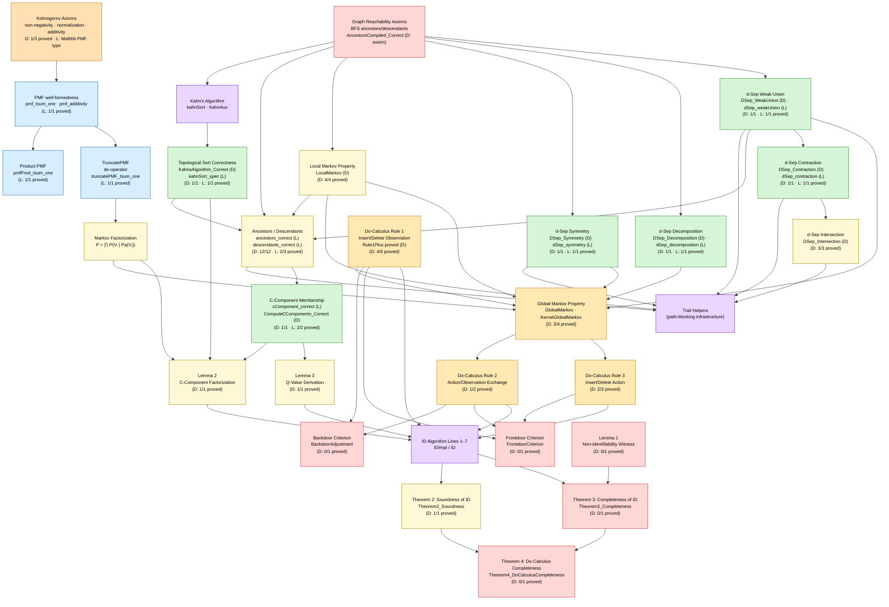

```mermaid
flowchart TD
    classDef bothProved fill:#d6f5d6,stroke:#2d8a2d,color:#000,padding:12px,font-size:13px
    classDef leanOnly   fill:#d6eeff,stroke:#1a6fa8,color:#000,padding:12px,font-size:13px
    classDef dafnyOnly  fill:#fff8d6,stroke:#a08800,color:#000,padding:12px,font-size:13px
    classDef unproved   fill:#ffd6d6,stroke:#cc3333,color:#000,padding:12px,font-size:13px
    classDef partial    fill:#ffe8b2,stroke:#cc7700,color:#000,padding:12px,font-size:13px
    classDef algo       fill:#ead6ff,stroke:#6622cc,color:#000,padding:12px,font-size:13px
    classDef mathlib    fill:#ffe0b2,stroke:#cc6600,color:#000,padding:12px,font-size:13px
    n_ANC["Ancestors / Descendants\nancestors_correct (L)\ndescendants_correct (L)
(D: 12/12 · L: 2/3 proved)"]:::dafnyOnly
    n_BKD["Backdoor Criterion\nBackdoorAdjustment
(D: 0/1 proved)"]:::unproved
    n_CCOMP["C-Component Membership\ncComponent_correct (L)\nComputeCComponents_Correct (D)
(D: 1/1 · L: 2/2 proved)"]:::bothProved
    n_CONT["d-Sep Contraction\nDSep_Contraction (D) · dSep_contraction (L)
(D: 1/1 · L: 1/1 proved)"]:::bothProved
    n_DEC["d-Sep Decomposition\nDSep_Decomposition (D) · dSep_decomposition (L)
(D: 1/1 · L: 1/1 proved)"]:::bothProved
    n_FRD["Frontdoor Criterion\nFrontdoorCriterion
(D: 0/1 proved)"]:::unproved
    n_GM["Global Markov Property\nGlobalMarkov · KernelGlobalMarkov
(D: 3/4 proved)"]:::partial
    n_ID["ID Algorithm Lines 1–7\nIDImpl / ID"]:::algo
    n_INTER["d-Sep Intersection\nDSep_Intersection (D)
(D: 3/3 proved)"]:::dafnyOnly
    n_K["Kolmogorov Axioms\nnon-negativity · normalization · additivity\nD: 1/3 proved · L: Mathlib PMF type"]:::mathlib
    n_KAHN_ALGO["Kahn's Algorithm\nkahnSort · KahnAux"]:::algo
    n_KAHN_PROOF["Topological Sort Correctness\nKahnsAlgorithm_Correct (D)\nkahnSort_spec (L)
(D: 1/1 · L: 1/1 proved)"]:::bothProved
    n_L1["Lemma 1\nNon-Identifiability Witness
(D: 0/1 proved)"]:::unproved
    n_L2["Lemma 2\nC-Component Factorization
(D: 1/1 proved)"]:::dafnyOnly
    n_L3L["Lemma 3\nQ-Value Derivation
(D: 1/1 proved)"]:::dafnyOnly
    n_LMARKOV["Local Markov Property\nLocalMarkov (D)
(D: 4/4 proved)"]:::dafnyOnly
    n_MARKOV["Markov Factorization\nP = ∏ P(Vᵢ | Pa(Vᵢ))"]:::dafnyOnly
    n_PMF["PMF well-formedness\npmf_tsum_one · pmf_additivity
(L: 1/1 proved)"]:::leanOnly
    n_PROD["Product PMF\npmfProd_tsum_one
(L: 1/1 proved)"]:::leanOnly
    n_R1["Do-Calculus Rule 1\nInsert/Delete Observation\nRule1Plus proved (D)
(D: 4/5 proved)"]:::partial
    n_R2["Do-Calculus Rule 2\nAction/Observation Exchange
(D: 1/2 proved)"]:::partial
    n_R3["Do-Calculus Rule 3\nInsert/Delete Action
(D: 2/3 proved)"]:::partial
    n_REACH["Graph Reachability Axioms\nBFS ancestors/descendants\nAncestorsCompiled_Correct (D: axiom)"]:::unproved
    n_SYM["d-Sep Symmetry\nDSep_Symmetry (D) · dSep_symmetry (L)
(D: 1/1 · L: 1/1 proved)"]:::bothProved
    n_T2["Theorem 2: Soundness of ID\nTheorem2_Soundness
(D: 1/1 proved)"]:::dafnyOnly
    n_T3["Theorem 3: Completeness of ID\nTheorem3_Completeness
(D: 0/1 proved)"]:::unproved
    n_T4["Theorem 4: Do-Calculus Completeness\nTheorem4_DoCalculusCompleteness
(D: 0/1 proved)"]:::unproved
    n_TRAIL["Trail Helpers\n(path-blocking infrastructure)"]:::algo
    n_TRUNC["TruncatePMF\ndo-operator\ntruncatePMF_tsum_one
(L: 1/1 proved)"]:::leanOnly
    n_WU["d-Sep Weak Union\nDSep_WeakUnion (D) · dSep_weakUnion (L)
(D: 1/1 · L: 1/1 proved)"]:::bothProved

    n_ANC --> n_TRAIL
    n_LMARKOV --> n_ANC
    n_LMARKOV --> n_TRAIL
    n_SYM --> n_TRAIL
    n_WU --> n_TRAIL
    n_WU --> n_ANC
    n_CONT --> n_TRAIL
    n_INTER --> n_TRAIL
    n_R1 --> n_GM
    n_K --> n_PMF
    n_PMF --> n_PROD
    n_PMF --> n_TRUNC
    n_TRUNC --> n_MARKOV
    n_MARKOV --> n_GM
    n_REACH --> n_KAHN_ALGO
    n_REACH --> n_ANC
    n_KAHN_ALGO --> n_KAHN_PROOF
    n_KAHN_PROOF --> n_ANC
    n_ANC --> n_CCOMP
    n_REACH --> n_LMARKOV
    n_REACH --> n_SYM
    n_REACH --> n_DEC
    n_REACH --> n_WU
    n_WU --> n_CONT
    n_CONT --> n_INTER
    n_LMARKOV --> n_GM
    n_SYM --> n_GM
    n_DEC --> n_GM
    n_WU --> n_GM
    n_GM --> n_R2
    n_GM --> n_R3
    n_R1 --> n_BKD
    n_R2 --> n_BKD
    n_R1 --> n_FRD
    n_R2 --> n_FRD
    n_R3 --> n_FRD
    n_R1 --> n_ID
    n_R2 --> n_ID
    n_R3 --> n_ID
    n_L2 --> n_ID
    n_L3L --> n_ID
    n_MARKOV --> n_L2
    n_KAHN_PROOF --> n_L2
    n_CCOMP --> n_L2
    n_CCOMP --> n_L3L
    n_ID --> n_T2
    n_ID --> n_T3
    n_L1 --> n_T3
    n_T2 --> n_T4
    n_T3 --> n_T4
```
