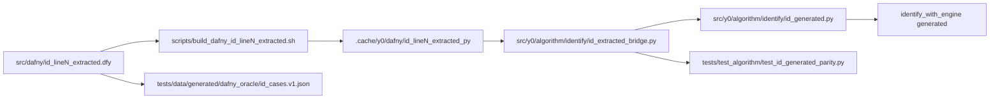

# Phase 1-4 Checklist: Auto-Generate ID Implementation from Dafny

# Critical Path-Focused Plan: Concrete, Extractable ID Algorithm in Dafny

## Overview

This plan is organized around the minimal critical path to a fully concrete,
extraction-ready, and testable ID algorithm in Dafny that emits probability
expressions for all identifiable queries.

**Critical Path Steps:**

1. Define a concrete IRNode/IRDoc datatype in Dafny matching the Python IR
   schema.
2. Implement an executable (non-ghost, non-axiom) IDToIR method that returns
   IRDoc for any query.
3. Eliminate all ghost/axiom/assume constructs in the generation path—every
   set/sequence operation, recursion, and node construction must be executable
   and deterministic.
4. Ensure all set-to-sequence conversions (e.g., C-components, variable lists)
   are deterministic and stable for extraction.
5. Add and enforce a canonicalization predicate (IsCanonicalIRDoc) so all
   outputs are sorted, merged, and normalized as required by the Python
   validator.
6. Implement serialization hooks to emit IRDoc as JSON for downstream use.
7. Integrate with Python adapters and IR-to-DSL translation, and validate
   end-to-end with parity and determinism tests.

All other tasks, tests, and documentation should support or validate these
steps.

## Goal

Produce an auto-generated Python ID implementation that is behaviorally
equivalent to the current handwritten implementation and is backed by Dafny
specifications, generated conformance tests, and regression parity checks.

## Status Update (2026-05-10)

### What Has Been Accomplished

1. Extracted runtime slices integrated for ID line 1, line 2, and line 5.
2. Generated engine dispatch now routes through extracted line handlers in order,
   with conservative fallback to handwritten logic when a slice is unavailable or
   not applicable.
3. Oracle fixtures and parity tests were extended to cover extracted line 5
   hedge behavior.
4. Line 5 work was checkpointed in commit `e443aea`.

### Quality Evidence (Most Recent)

1. `bash scripts/build_dafny_id_line5_extracted.sh`
   - Passed: line 5 module verified and translated successfully.
2. `python scripts/check_dafny_id_line5_extracted_runtime.py`
   - Passed: canonical fail/hedge IR emitted with expected witness shape.
3. `pytest tests/test_algorithm/test_id_generated_parity.py -q`
   - Passed: 9 tests.
4. `dafny verify src/dafny/identification.dfy --verification-time-limit:30 --isolate-assertions --progress:Batch`
   - Passed: 575 verified, 0 errors.

Note: `--log-format:text` intermittently failed to return terminal output in this
environment; redirecting verification output to a file and checking exit code is
the reliable gate.

### Current Direction (Next Slice)

Execute line 4 next using the same extracted-first workflow:

1. Add standalone executable module `src/dafny/id_line4_extracted.dfy` that
   emits line 4 decomposition IR.
2. Add build/smoke scripts for line 4 extraction in `scripts/`.
3. Integrate line 4 support predicates and bridge invocation in generated
   routing.
4. Add/update oracle fixture cases for extracted line 4.
5. Extend generated parity tests for line 4 route preference and fallback.
6. Re-run quality gates (line 4 build/smoke + generated parity +
   identification verification).

### Deferred/Out-of-Scope For This Step

1. Line 3 full recursive integration remains deferred due to prior IR-shape
   compatibility risk; keep fallback-safe behavior unless revisited explicitly.

### Remaining Lines Strategy (Updated)

Execution order for the remaining slices:

1. Line 6
2. Line 7
3. Line 3 (last)

Rationale:

1. Line 6 is mostly local expression construction and has the lowest expected
   integration risk.
2. Line 7 is recursive and order-sensitive but still more controllable than line 3.
3. Line 3 has known recursive IR compatibility risk and should be handled last,
   after line 6/7 reduce unknowns.

Per-line execution template (must pass before advancing):

1. Add executable Dafny extraction module.
2. Add build and smoke scripts.
3. Add strict support predicate + bridge invocation in generated path.
4. Add oracle fixture coverage.
5. Add generated route/fallback parity tests.
6. Run gates: extracted build/smoke, parity file, broad identification verify.

Risks and mitigations (pre-committed):

1. Risk: route-stealing from overly broad support predicates.
   - Mitigation: strict preconditions and explicit negative route tests for nearby lines.
2. Risk: extracted expression shape differs from handwritten though semantically close.
   - Mitigation: canonical expression equality tests on at least one real end-to-end case per line.
3. Risk: Dafny translation output directory suffix drift.
   - Mitigation: wildcard discovery of `id_lineN_extracted-py*` in build scripts.
4. Risk: recursive line regressions only show up in broader suite.
   - Mitigation: run broad `identification.dfy` verification gate and parity gate after each line.
5. Risk: line 3 recursive IR nodes break canonical validator path.
   - Mitigation: keep narrow line 3 support initially; map canonicalization/shape failures to extracted-unavailable fallback.

### Workflow: Visualize Existing Extracted Scaffolding and Insertion Points

Use this workflow before implementing any new line slice so route order, support
predicates, bridge hooks, and test coverage stay aligned.

1. Build a one-screen topology view of extracted assets.

```bash
rg --files src/dafny scripts src/y0/algorithm/identify tests/test_algorithm \
   | rg "id_line[0-9]+_extracted\.dfy|build_dafny_id_line[0-9]+_extracted\.sh|check_dafny_id_line[0-9]+_extracted_runtime\.py|id_extracted_bridge\.py|id_generated\.py|test_id_generated_parity\.py|id_cases\.v1\.json"
```

2. Visualize bridge scaffolding and existing line hooks.

```bash
rg -n "ExtractedLine[0-9]+UnavailableError|_EXTRACTED_MODULE_NAME_L[0-9]+|_EXTRACTED_METHOD_NAME_L[0-9]+|_ENV_EXTRACTED_DIR_L[0-9]+|supports_query_line[0-9]+|identify_line[0-9]+_from_extracted" src/y0/algorithm/identify/id_extracted_bridge.py
```

Expected output pattern per line N:
1. constants: module/method/env names
2. unavailable exception type
3. loader resolver and module import helper
4. supports_query_lineN predicate
5. identify_lineN_from_extracted bridge function

3. Visualize generated dispatcher route order (and insertion location).

```bash
rg -n "supports_query_line|identify_line[0-9]+_from_extracted|ExtractedLine[0-9]+UnavailableError|identify_handwritten" src/y0/algorithm/identify/id_generated.py
```

Insertion rule:
1. add imports for the new line support and extracted function
2. add one if/try/except block in strict numeric route order
3. keep handwritten fallback as terminal path

4. Visualize parity test hooks and route/fallback expectations.

```bash
rg -n "line[0-9]|supports_line|extracted_line|routing calls|fallback" tests/test_algorithm/test_id_generated_parity.py
```

For each new line N, add two tests:
1. prefers extracted path when supports_query_lineN is true
2. falls back cleanly when supports_query_lineN is false

5. Visualize oracle linkage and source registration.

```bash
rg -n "dafny_files|id\.line[0-9]|anchor|expectation" tests/data/generated/dafny_oracle/id_cases.v1.json
```

6. Keep this architecture map in mind during insertion.



7. Use this insertion checklist for a new line slice.

1. Add extracted Dafny module and line-specific build/smoke scripts.
2. Add bridge constants, loader, support predicate, and extracted call wrapper.
3. Add generated dispatcher import and route block at correct order position.
4. Add parity route/fallback tests and expected call-order assertions.
5. Register source linkage in oracle metadata.
6. Run gates: line build, line smoke, parity test file, broad identification verify.

    - fail -> raise Unidentifiable(F, Fprime)

8. Mapping from ID lines to preferred IR constructors:
   - line 1: sum(prob(...))
   - line 2: sum of reduced ancestral body
   - line 3: same body shape with expanded treatment context
   - line 4: sum(product(subcalls))
   - line 5: fail(hedge)
   - line 6: sum(product(local conditionals))
   - line 7: recursive subproblem expression (usually sum/product nesting)

### IR examples (fixtures)

1. Identifiable shape (line-4 style):

```json
{
  "version": "1",
  "engine": "id",
  "query": {
    "graph_id": "frontdoor_small",
    "outcomes": ["Y"],
    "treatments": ["X"],
    "ordering": ["X", "Z", "Y"]
  },
  "result": {
    "tag": "sum",
    "over": ["Z"],
    "body": {
      "tag": "product",
      "factors": [
        { "tag": "prob", "vars": ["Z"], "given": ["X"], "intervened": [] },
        {
          "tag": "sum",
          "over": ["X"],
          "body": {
            "tag": "prob",
            "vars": ["Y", "X"],
            "given": ["Z"],
            "intervened": []
          }
        }
      ]
    }
  }
}
```

2. Non-identifiable shape (line-5 hedge):

```json
{
  "version": "1",
  "engine": "id",
  "query": {
    "graph_id": "figure1a_like",
    "outcomes": ["Y"],
    "treatments": ["X"],
    "ordering": ["X", "Y"]
  },
  "result": {
    "tag": "fail",
    "kind": "hedge",
    "F_nodes": ["X", "Y"],
    "Fprime_nodes": ["Y"]
  }
}
```

### Phase 2 implementation notes

1. Keep schema minimal and closed in v1. Additive changes require v2.
2. Prefer explicit frac nodes over implicit conditional rewriters to avoid
   ambiguity.
3. Keep hedge witness data in the IR so parity tests can assert exact failure
   class, not only exception type.
4. Store one fixture per query in tests/data/id_ir_cases.json and one generated
   corpus in tests/data/generated/id_from_dafny_cases.json.

### Minimal concrete expression layer interface (exact)

Define one executable boundary in Dafny that returns only expression IR data,
not PMFs.

1. New Dafny module surface (minimal):

```dafny
datatype IRNode =
   | IRSum(over: seq<Node>, body: IRNode)
   | IRProduct(factors: seq<IRNode>)
   | IRProb(vars: seq<Node>, given: seq<Node>, intervened: seq<Node>)
   | IRFrac(numer: IRNode, denom: IRNode)
   | IRFailHedge(F_nodes: seq<Node>, Fprime_nodes: seq<Node>)

datatype IRDoc = IRDoc(
   version: string,
   engine: string,
   graph_id: string,
   outcomes: seq<Node>,
   treatments: seq<Node>,
   ordering: seq<Node>,
   result: IRNode
)

method IDToIR(
   sm: SMGraph,
   X: set<Node>,
   Y: set<Node>,
   ord: seq<Node>,
   graphId: string
) returns (doc: IRDoc)
   requires ValidQuery(CausalQuery(sm, X, Y))
   requires SMTopologicalSort(sm, ord)
   ensures doc.version == "1"
   ensures doc.engine == "id"
   ensures doc.graph_id == graphId
   ensures IsCanonicalIRDoc(doc)
```

2. Required canonicality predicate contracts:
   - IsCanonicalIRDoc(doc) must imply all ordering/shape constraints already
     enforced by src/y0/algorithm/identify/id_ir.py.
   - In particular:
     - all seq<Node> fields are sorted lexically except ordering
     - IRProduct factors are deterministically ordered
     - nested IRSum nodes are merged
     - IRProb.given and IRProb.intervened are disjoint
     - IRFailHedge appears only at root

3. Branch-to-node mapping contract for IDToIR:
   - line 1 -> IRSum(IRProb(...))
   - line 2 -> IRSum(reduced ancestral body)
   - line 3 -> recursive call with expanded X; no new tag
   - line 4 -> IRSum(IRProduct(subcalls))
   - line 5 -> IRFailHedge(F, F')
   - line 6 -> IRSum(IRProduct(local conditionals))
   - line 7 -> IRFrac(...) or equivalent normalized recursive subtree

4. Minimal Python adapter surface (handwritten, stable):

```python
def dafny_ir_doc_to_jsonable(doc: object) -> dict[str, object]:
      """Convert extracted Dafny IRDoc object to v1 JSON dictionary."""

def build_oracle_case_from_doc(
      *,
      case_id: str,
      module: str,
      anchor_symbol: str,
      anchor_line: int,
      doc_json: dict[str, object],
) -> dict[str, object]:
      """Wrap one IR document into fixture case schema."""

def canonicalize_and_validate_doc(doc_json: dict[str, object]) -> dict[str, object]:
      """Call canonicalize_ir_document and return canonical payload."""
```

5. Fixture envelope emitted by generator (aligned with Phase 3 schema):
   - schema_version: integer
   - source: metadata block
   - cases: list of case objects, each with:
     - case_id
     - module = "identification"
     - anchor.symbol and anchor.line
     - query (copied from doc.query)
     - expectation.kind = "ir"
     - expectation.value = canonicalized doc

6. Minimum acceptance checks for this interface:
   - Extracted/serialized doc passes canonicalize_ir_document unchanged.
   - Repeated generation for same input yields byte-identical JSON.
   - ID line-5 examples serialize to fail/hedge payload with F_nodes and
     Fprime_nodes.
   - At least one identifiable case and one fail case run through tests/oracle
     runner.

7. Explicit non-goals in this minimal interface:
   - No PMF numeric evaluation in Dafny.
   - No direct translation of full ghost theorem layer.
   - No requirement that every theorem is executable; only IDToIR branch
     behavior is executable.

### Exact file edits

1. Add src/y0/algorithm/identify/id_ir.py
   - Define IR node types for Sum, Product, ConditionalTerm, AtomicProbability,
     Fail.
   - Define stable JSON-serializable shape and validator.

2. Edit src/dafny/identification.dfy
   - Add a generation contract section documenting mapping from IDResult
     branches to IR constructors.
   - Add comments and naming alignment for all seven lines.

3. Add tests/data/id_ir_cases.json
   - Hand-authored seed cases for line 1 through line 7 and fail case.

4. Add tests/test_algorithm/test_id_ir.py
   - Parse and validate seed IR fixtures
   - Check canonical ordering and normalization behavior

### TDD tasks

1. Write failing tests first in tests/test_algorithm/test_id_ir.py:
   - Invalid IR rejected
   - Valid IR round-trips
   - Canonical ordering stable

2. Implement minimal IR code until green.

### Acceptance tests

1. Python:
   - pytest tests/test_algorithm/test_id_ir.py -q

2. Formal/documentation:
   - dafny verify src/dafny/identification.dfy --verification-time-limit:30

3. Pass criteria:
   - IR schema is stable and validated
   - ID branch-to-IR mapping documented and consistent

---

- For each identifiable IR fixture, the IR is translated to a y0 DSL probability
  expression using id_ir_to_dsl.py, and the resulting expression is validated
  for well-formedness and canonicalization (type checks, structure, and
  normalization).

## Phase 3: Extend Generator to Emit ID Conformance + IR Fixtures

### Outcome

Upgrade the existing Dafny test generator to parse identification module
artifacts and emit:

1. ID conformance tests, and
2. IR fixture cases used for generation and parity checks.

### Exact file edits

1. Edit scripts/generate_dafny_conformance_tests.py
   - Parse src/dafny/identification.dfy
   - Add generator section for ID line tests
   - Emit deterministic fixture ordering

2. Add tests/test_dafny_id_correspondence.py (generated)
   - Line-by-line conformance tests for ID behavior contracts

3. Add tests/data/generated/id_from_dafny_cases.json (generated)
   - Canonical IR fixtures from parsed spec anchors

4. Edit docs/plans/2025-05-07-dafny-formal-specification-retrofit.md
   - Add ID generation pipeline section and regeneration command updates

### TDD tasks

1. Add generator unit tests (new file): tests/test_generator_id_conformance.py
   - Fails if identification module is not parsed
   - Fails if generated outputs are unstable across repeated runs

2. Regenerate and run tests only after red state confirmed.

### Acceptance tests

1. Generator:
   - python scripts/generate_dafny_conformance_tests.py

2. Python:
   - pytest tests/test_generator_id_conformance.py -q
   - pytest tests/test_dafny_id_correspondence.py -q

3. Formal:
   - dafny verify src/dafny/identification.dfy --verification-time-limit:30

4. Pass criteria:
   - Generated ID files are deterministic and green

### Phase 3 target architecture (fixture-first)

Use generated JSON fixtures as the primary artifact and keep test execution
logic handwritten and stable.

1. Target folder layout:
   - scripts/dafny_oracle/
     - parse.py: Dafny parser -> typed internal model
     - map_to_ir.py: spec model -> canonical ID IR fixtures
     - map_to_contracts.py: spec model -> contract fixtures for non-ID sections
     - emit.py: deterministic JSON emitters
   - tests/data/generated/dafny_oracle/
     - id_cases.v1.json
     - dag_contracts.v1.json
     - do_calculus_contracts.v1.json
     - probability_contracts.v1.json
   - tests/oracle/
     - test_dafny_oracle_runner.py: stable runner consuming fixtures
     - test_dafny_oracle_snapshots.py: determinism/snapshot checks
   - src/y0/algorithm/identify/
     - id_ir.py: shared schema + validator + normalization
     - id_ir_to_dsl.py: translation layer from IR to y0 DSL

2. Generated fixture schema (minimal):
   - top-level:
     - schema_version: integer
     - generated_at: ISO timestamp (optional in comparison mode)
     - source:
       - dafny_files: list of relative paths
       - commit: git commit hash (optional)
     - cases: list of case objects
   - case object:
     - case_id: stable string key
     - module: dag | do_calculus | probability | identification
     - anchor:
       - symbol: lemma/function name
       - line: source line number
     - query: graph and variable metadata (when applicable)
     - expectation:
       - kind: ir | boolean | exception | algebraic_equivalence
       - value: expectation payload

3. Stable runner API (handwritten, not generated):
   - load_fixture(path) -> OracleFixture
   - iter_cases(fixture, module: str | None = None) -> Iterator[OracleCase]
   - run_case(case, engine: str = "handwritten") -> OracleResult
   - assert_case(case, result) -> None
   - normalize_expression(expr) -> CanonicalExpr

4. Determinism rules:
   - Cases sorted by (module, anchor.symbol, case_id)
   - Variable lists sorted lexically unless topological order is explicitly
     required
   - No nondeterministic UUIDs in emitted fixtures
   - Timestamp and commit hash omitted in strict snapshot mode

5. Migration strategy from current generator:
   - Step A: Keep scripts/generate_dafny_conformance_tests.py as facade
     entrypoint
   - Step B: Move parser and mapping internals into scripts/dafny_oracle/\*
   - Step C: Emit both legacy pytest output and new fixtures for one release
     window
   - Step D: Add oracle runner tests over fixtures
   - Step E: Remove legacy generated pytest module once parity and coverage are
     proven

6. Phase 3 acceptance additions:
   - python scripts/generate_dafny_conformance_tests.py --emit-fixtures
   - pytest tests/oracle/test_dafny_oracle_runner.py -q
   - pytest tests/oracle/test_dafny_oracle_snapshots.py -q
   - git diff --exit-code tests/data/generated/dafny_oracle

### Phase 3.5: First executable oracle slice

Define the minimal typed interfaces and one tiny fixture corpus so
implementation can start before full migration is complete.

1. Add src/y0/algorithm/identify/id_oracle_types.py
   - Define TypedDict or dataclass models:
     - OracleAnchor
     - OracleQuery
     - OracleExpectation
     - OracleCase
     - OracleFixture
   - Keep fields aligned with Phase 3 schema and Phase 2 IR schema.

2. Type signatures (minimum):
   - load_fixture(path: Path) -> OracleFixture
   - save_fixture(path: Path, fixture: OracleFixture) -> None
   - iter_cases(fixture: OracleFixture, module: str | None = None) ->
     Iterator[OracleCase]
   - run_case(case: OracleCase, engine: str = "handwritten") -> object
   - assert_case(case: OracleCase, actual: object) -> None

3. Add tests/data/generated/dafny_oracle/id_cases.v1.json
   - Include exactly two seed cases:
     - one identifiable IR case
     - one hedge fail case
   - Keep these manually curated at first; generated corpus can supersede later.

4. Add tests/oracle/test_dafny_oracle_minimal.py
   - test_fixture_loads
   - test_case_iteration_order_stable
   - test_identifiable_case_executes
   - test_fail_case_raises_unidentifiable

5. Phase 3.5 acceptance tests:
   - pytest tests/oracle/test_dafny_oracle_minimal.py -q
   - python -m json.tool tests/data/generated/dafny_oracle/id_cases.v1.json >
     /dev/null

---

## Phase 4: Auto-Generated Python ID + Parity Harness

### Outcome

Generate and integrate a production-ready Python ID implementation from IR
fixtures/contracts, then prove behavioral parity against handwritten identify
across benchmark suites.

### Exact file edits

1. Add src/y0/algorithm/identify/id_generated.py
   - Generated implementation entrypoint
   - No handwritten logic beyond thin adapters

2. Edit src/y0/algorithm/identify/**init**.py
   - Export generated implementation behind explicit API selector

3. Add src/y0/algorithm/identify/id_dispatch.py
   - Runtime switch for handwritten vs generated engine

4. Add tests/test_algorithm/test_id_generated_parity.py
   - Parametrized parity tests for identifiable and unidentifiable benchmark
     graphs

5. Edit tests/test_is_identifiable.py
   - Parameterize to run with both engines

6. Add scripts/compare_id_engines.py
   - CLI summary for parity runs and expression normalization mismatches

### TDD tasks

1. Write parity tests first so generated engine initially fails.
2. Implement generator output + adapters until parity is green.
3. Lock regression corpus from existing examples and figure-based cases.

### Acceptance tests

1. Python:
   - pytest tests/test_algorithm/test_id_alg.py -q
   - pytest tests/test_is_identifiable.py -q
   - pytest tests/test_algorithm/test_id_generated_parity.py -q

2. Optional broader confidence:
   - pytest tests/test_algorithm -k "id" -q

3. Formal:
   - dafny verify src/dafny/\*.dfy

4. Pass criteria:
   - Generated and handwritten engines agree on success/failure class
   - For at least one identifiable case, the generated engine returns a concrete
     y0 probability expression object (not just validated IR/parity class)
   - The emitted expression from the generated engine canonicalizes stably
     (i.e., repeated runs yield the same normalized expression)
   - Expressions match after normalization for benchmark corpus

---

## Execution Order and Review Checkpoints

1. Complete Phase 1 and stop for review.
2. Complete Phase 2 and stop for review.
3. Complete Phase 3 and stop for review.
4. Complete Phase 4 and stop for release decision.

At each checkpoint, attach:

1. File diff summary
2. Red-to-green test evidence
3. Dafny verification output summary
4. Known limitations and next risks

---

## Known Risks and Mitigations

1. Risk: Axiomatized lemmas remain unavoidable in deep theorem sections.
   - Mitigation: Keep generation contracts tied to executable control-flow
     subset only.

2. Risk: Expression equivalence false negatives due to formatting/order.
   - Mitigation: Use canonical normalization before parity assertions.

3. Risk: Generator drift from Dafny comments/anchors.
   - Mitigation: Add strict parser tests and deterministic output snapshots.

4. Risk: Timeout regressions in ID line-4 proof obligations.
   - Mitigation: Preserve helper-lemma staging and isolate-assertions checks in
     CI.

---

## Minimal CI Additions After Phase 4

1. Add a tracked-file lint + generation check target that runs:
   - python scripts/generate_dafny_conformance_tests.py
   - pytest tests/test_generator_id_conformance.py -q
   - pytest tests/test_algorithm/test_id_generated_parity.py -q
2. Fail CI on dirty generated outputs.
3. Keep formal verification lane for src/dafny/identification.dfy at 30s limit.
