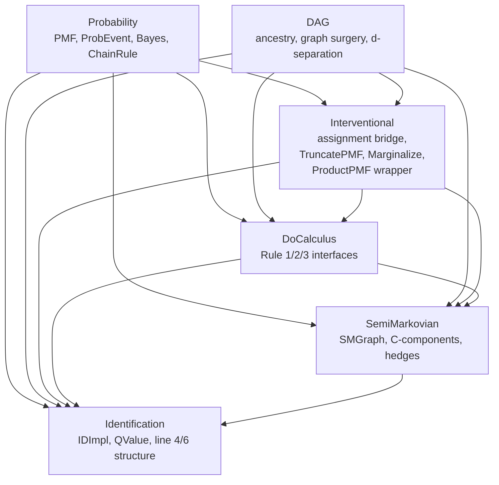
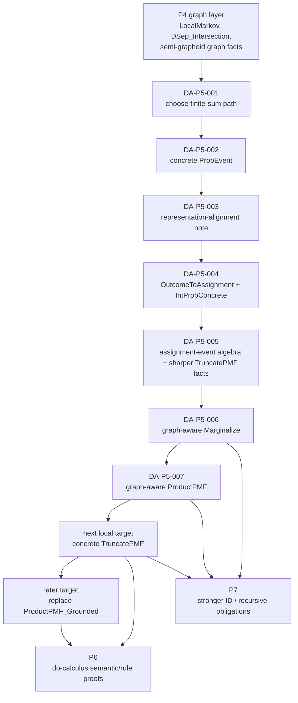
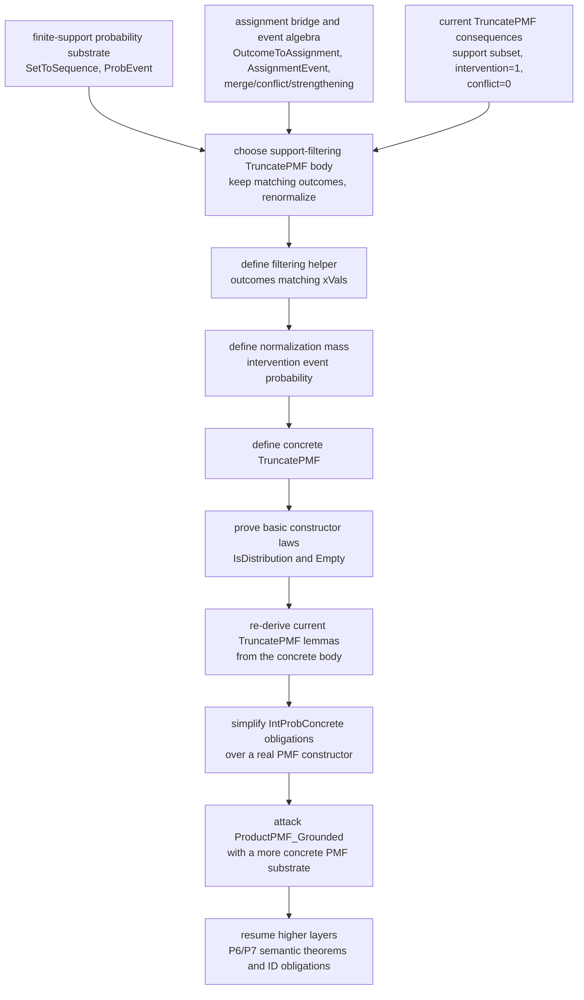

# Dafny Proof Dependency DAGs

Date: 2026-05-22

Related documents:

- `docs/plans/2026-05-19-dafny-de-axiomitization-progress.md`
- `docs/plans/2026-05-19-dafny-axiom-ledger.md`
- `docs/plans/2026-05-21-dafny-probability-assignment-alignment.md`

This note collects three different DAGs for understanding the current Dafny
proof-building exercise.

Each DAG answers a different question:

1. The module DAG answers: "which source layer depends on which lower layer?"
2. The proof-batch DAG answers: "which completed proof batches made the next
   ones feasible?"
3. The operational DAG answers: "if the goal is to keep removing proof debt
   with the smallest local next step, what should be proved next and why?"

These graphs are intentionally different.

An edge in the module DAG means a direct code or semantic dependency. An edge
in the proof-batch DAG or the operational DAG means a proof-engineering
dependency: one item made the next item tractable, even if there is no single
formal theorem stating that relationship.

## How To Read These DAGs

The same repository can be read at three different levels:

1. file/module structure,
2. implementation-batch history,
3. immediate local proving strategy.

The earlier conversations mixed these levels because they are tightly coupled.
For example, `Identification.IDImpl` lives high in the module stack, but some
of its recent verification timeouts were caused by missing low-level facts in
the interventional translation layer. The point of separating the DAGs is to
make those distinctions explicit.

## DAG 1: Module And Semantic Layering

Purpose:

Explain where each major concept lives and why higher-level files are harder to
de-axiomatize: they inherit all remaining abstraction debt below them.

Design choices:

1. Nodes are whole Dafny modules, not individual lemmas.
2. `SemiMarkovian` is shown as its own layer because the C-component and hedge
   substrate is a distinct dependency for identification.
3. The graph shows current semantic layering, not the full include/import graph
   for every helper symbol.

Reading guide:

1. `Probability` and `DAG` are the base mathematical layers.
2. `Interventional` is where PMFs and graph structure first meet.
3. `DoCalculus` relies on both graph semantics and interventional semantics.
4. `SemiMarkovian` adds the hidden-variable graph substrate used by the ID
   algorithm.
5. `Identification` is highest in the stack, so proof debt there is often
   really inherited debt from lower layers.

## DAG 2: Proof-Batch Dependency Flow

Purpose:

Explain how the recent proof campaign actually progressed from graph theorems
into the probability and interventional boundary work.

Design choices:

1. Nodes are proof batches or design batches, not source files.
2. The graph emphasizes the P4 to P5 transition, because that is where the
   current work changed from pure graph proofs to PMF/assignment alignment.
3. The arrows mean "this batch removed the blocker that made the next batch
   realistic", not "the later theorem is a formal corollary of the earlier
   theorem".

Reading guide:

1. P4 closed the remaining graph-theoretic blockers.
2. P5 first made event probability concrete.
3. P5 then introduced the translation layer between abstract PMF outcomes and
   assignment-level reasoning.
4. The current frontier is still P5, because the interventional constructors
   remain only partially concrete.

## DAG 3: Operational Next-Step DAG

Purpose:

Explain the recommended proving order for the next batch inside
`interventional.dfy`, with emphasis on why the next best local target is
`TruncatePMF` rather than `ProductPMF_Grounded`.

Design choices:

1. Nodes represent concrete proving steps, not broad themes.
2. The graph intentionally chooses the support-filtering route for
   `TruncatePMF`, because that route fits the existing assignment-event lemmas.
3. The graph does not make a factor-level `TruncatePMF` construction primary,
   because `ConditionalFactor` and `MarkovFactorization` are still abstract and
   would widen the proof boundary too early.
4. `ProductPMF_Grounded` is placed after concrete `TruncatePMF` because it is a
   higher-order behavior theorem about products and merged assignments, not the
   first constructor that needs a body.

Reading guide:

1. The existing event algebra already gives a good language for support-level
   reasoning about interventions.
2. That makes a support-filtering definition of `TruncatePMF` the most local
   next move.
3. Once `TruncatePMF` is real, the current downstream lemmas stop resting on a
   constructor axiom.
4. After that, `ProductPMF_Grounded` becomes a better target because it can be
   proved against a more concrete interventional PMF substrate.

## Why The Third DAG Is More Operational

The first DAG tells you where concepts live.

The second DAG tells you how the proof campaign got here.

The third DAG tells you what to do next if the goal is to keep progress local
and reduce the chance of another solver blow-up in `Identification.IDImpl`.

That distinction matters because theorem proving has two separate questions:

1. "What is mathematically true?"
2. "What is the cheapest next fact to make the prover understand?"

The current recommendation is about the second question.

`ProductPMF_Grounded` is mathematically natural, but operationally it is a
heavier statement. It quantifies over sequences of PMFs, sequences of scopes,
sequences of assignments, pairwise-disjointness facts, and merged assignments.

`TruncatePMF` is a narrower constructor boundary. Turning it from an axiom into
a real finite-support object is more likely to retire multiple nearby axioms at
once and strengthen the whole interventional layer before the next deeper
theorem batch.

## Recommended Use

Use the DAGs in this order:

1. Start with the module DAG when you are trying to understand where a symbol
   belongs.
2. Use the proof-batch DAG when you are trying to understand why the recent
   commits happened in this order.
3. Use the operational DAG when choosing the next theorem-proving task.

If this note needs a future update, the main thing to keep stable is the
meaning of each graph. It is fine for nodes to change as the proof frontier
moves, but the three questions should stay distinct.